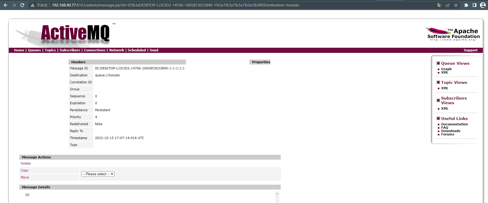

# ActiveMQ 反序列化漏洞

> 漏洞说明

**Apache ActiveMQ**是[Apache软件基金会](https://baike.baidu.com/item/Apache软件基金会?fromModule=lemma_inlink)所研发的开放源代码[消息中间件](https://baike.baidu.com/item/消息中间件?fromModule=lemma_inlink)；ActiveMQ是一个纯[Java](https://baike.baidu.com/item/Java?fromModule=lemma_inlink)程序，在5.13.0之前5.x版本中存在安全漏洞，该漏洞源于程序没有限制可在代理中序列化的类。远程攻击者可借助特制的序列化的Java Message Service(JMS)ObjectMessage对象利用该漏洞执行任意代码。

> 前提条件

需要管理员后台点击链接触发命令执行

版本：5.x < Apache ActiveMQ < 5.13.0

> 利用工具

[jmet](https://github.com/matthiaskaiser/jmet) (PS:工具下载后需要在同目录新建external和scripts文件夹，否则可能执行时报错ERROR d.c.j.JMET [main] Failed to setup external libraries!)

> 漏洞复现

启动靶场环境

访问8161端口可以看到ActiveMQ管理界面

nmap扫描可以发现靶机已开启ActiveMQ服务端口61616

> 漏洞复现

jmet添加列队任务测试命令执行

访问http://192.168.40.77:8161/admin/browse.jsp?JMSDestination=tomato查看创建的队列消息，ActiveMQ默认管理员账号密码为admin/admin

查看该队列消息即可触发命令执行

在靶机验证是否成功执行

本地开启监听,将执行命令换成反弹shell语句

成功getshell

在正常情况下我们无法得知管理后台账号密码，可以诱导管理员点击触发命令执行，或者伪装成其他合法服务需要的消息，等待客户端访问的时候触发。
