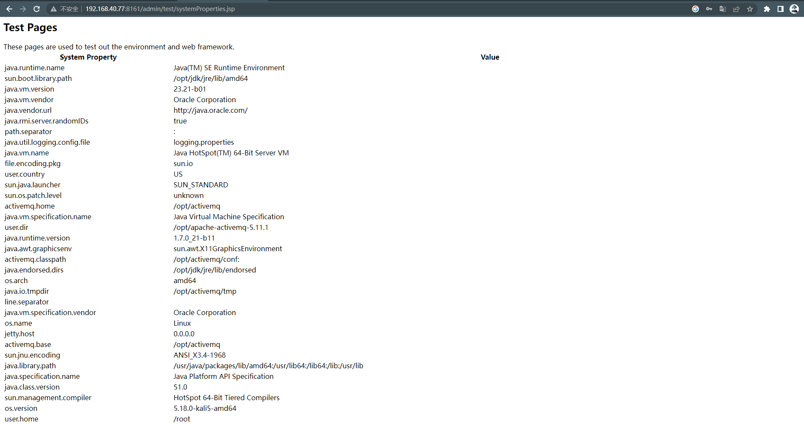
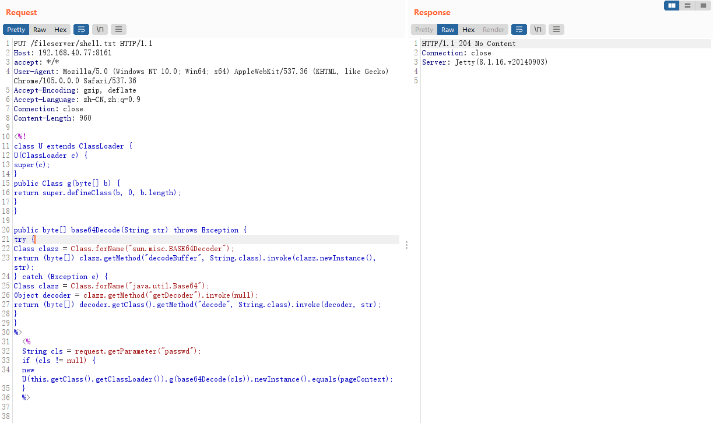
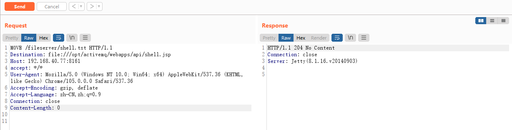
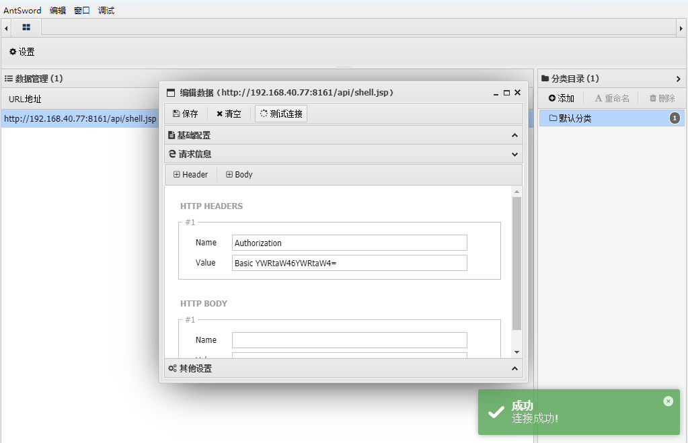

## ActiveMQ任意文件写入

> 漏洞说明

ActiveMQ的web控制台分三个应用，admin、api和fileserver，其中admin是管理员页面，api是接口，fileserver是储存文件的接口；admin和api都需要登录后才能使用，fileserver无需登录。

fileserver是一个RESTful API接口，我们可以通过GET、PUT、DELETE等HTTP请求对其中存储的文件进行读写操作，其设计目的是为了弥补消息队列操作不能传输、存储二进制文件的缺陷，但由于实际使用率不高并且文件操作导致容易产生漏洞，ActiveMQ在5.12.x~5.13.x版本中，已经默认关闭了fileserver这个应用（可以在conf/jetty.xml中开启之）；在5.14.0版本以后，彻底删除了fileserver应用。

本漏洞出现在fileserver应用中，fileserver支持写入文件（但不解析jsp），同时支持移动文件（MOVE请求）。所以需要写入一个文件，然后使用MOVE请求将其移动到任意位置，造成任意文件写入漏洞。

> 前提条件

文件写入有三种方法

1. 写入webshell（由于fileserver不解析jsp，可以写在admin或api应用中，但需要登录）
2. 写入cron或ssh key等文件（需要有对cron和ssh配置权限读写的root权限）
3. 写入jar或jetty.xml等库配置文件（需要jar后门，写入xml配置文件，但需要知道ActiveMQ的绝对路径）

版本：5.12.x < ActiveMQ < 5.13.x （默认关闭了fileserver，可以在conf/jetty.xml中开启）

> 利用工具

Burp Suite

> 漏洞复现

写入webshell

访问查看ActiveMQ绝对路径，默认账号密admin/admin

PUT传入Webshell

移动到web目录api文件夹

webshell上线

