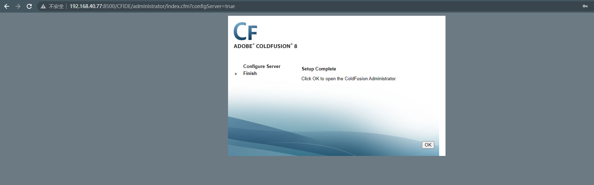
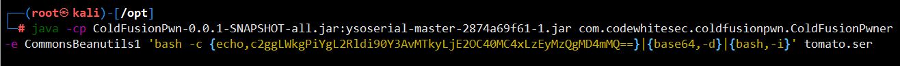
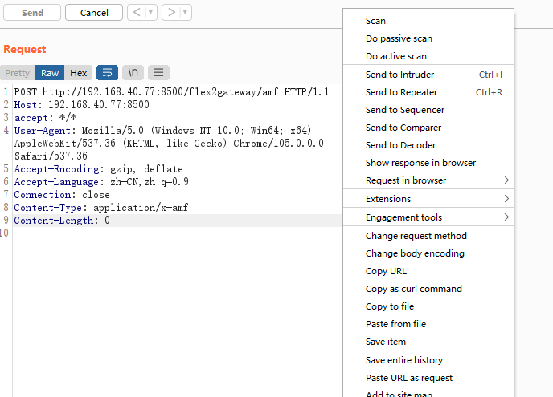
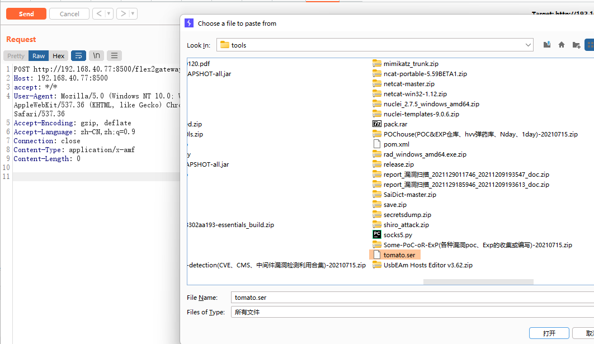
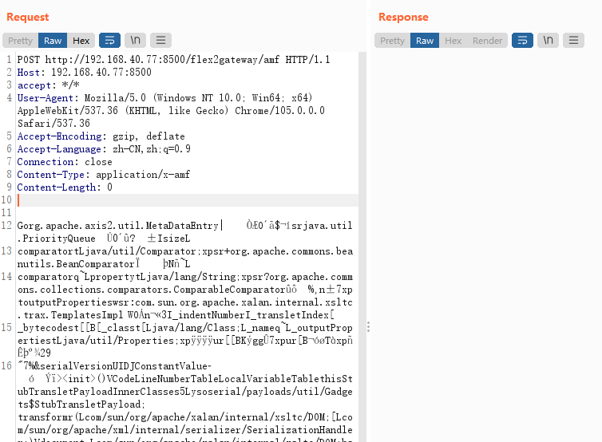
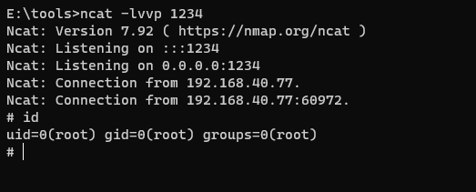

# Adobe-ColdFusion 反序列化漏洞

> 漏洞说明

Adobe ColdFusion是美国Adobe公司的一款动态Web服务器产品，其运行的CFML（ColdFusion Markup Language）是针对Web应用的一种程序设计语言。

Adobe ColdFusion中存在java反序列化漏洞。攻击者可利用该漏洞在受影响应用程序的上下文中执行任意代码或造成拒绝服务。

> 前提条件

Adobe ColdFusion (2016 release) Update 3及之前的版本

ColdFusion 11 Update 11及之前的版本

ColdFusion 10 Update 22及之前的版本

> 利用工具

[ColdFusionPwn-0.0.1-SNAPSHOT-all.jar](https://github.com/codewhitesec/ColdFusionPwn/releases/download/0.0.1/ColdFusionPwn-0.0.1-SNAPSHOT-all.jar)

[ysoserial-master-SNAPSHOT.jar](https://jitpack.io/com/github/frohoff/ysoserial/master-SNAPSHOT/ysoserial-master-SNAPSHOT.ja)

> 漏洞复现

环境启动，访问http://192.168.40.77:8500/CFIDE/administrator/index.cfm，输入密码vulhub，成功安装Adobe-ColdFusion

在Linux环境利用工具生成exp，Windows会报错

将生成的exp作为数据包body发送给http://192.168.40.77:8500/flex2gateway/amf,修改Content-Type为application/x-amf

选择paste from file

上传exp

发送请求包

由于编码问题，低版本bp(比如burpsuite_pro_v2.1.07)才能成功反弹shell,也可以使用postman方案https://cloud.tencent.com/developer/article/1888968代替

