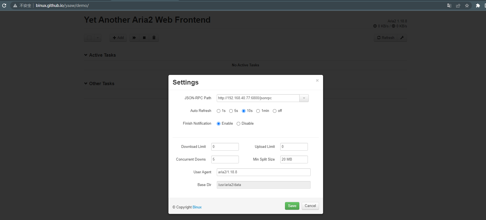
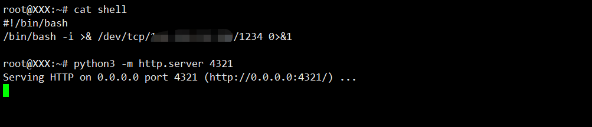
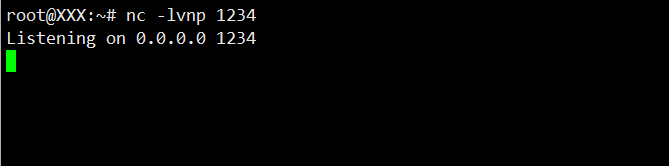
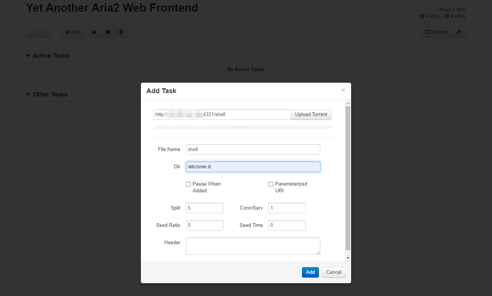
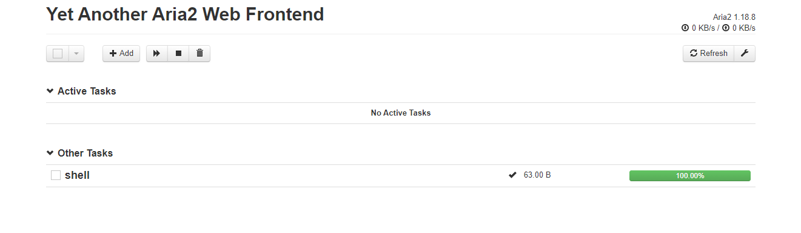
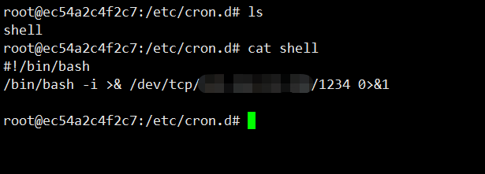
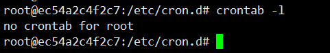

# Aria2 任意文件写入漏洞

> 漏洞说明

Aria2是一个命令行下轻量级、多协议、多来源的下载工具（支持 HTTP/HTTPS、FTP、BitTorrent、Metalink），内建XML-RPC和JSON-RPC接口。在有权限的情况下，我们可以使用RPC接口来操作aria2来下载文件，将文件下载至任意目录，造成一个任意文件写入漏洞。

> 前提条件

无

> 利用工具

[yaaw](http://binux.github.io/yaaw/demo/)

> 漏洞复现

800是aria2的rpc服务的默认端口,rpc通信需要使用json或者xml,开yaaw，点击配置按钮，填入运行aria2的目标域名：http://192.168.40.77:6800/jsonrpc

用vps准备一个反弹shell文件并开启http端口以便下载

nc开启监听

点击Add，增加一个新的下载任务。在Dir的位置填写下载至的目录，File Name处填写文件名。

成功下载

shell成功传至靶机目标文件夹

根据https://www.cnblogs.com/foe0/p/11353506.html，可能由于靶场环境不完整，crontab -l确实没有看到定时任务，无法反弹shell

