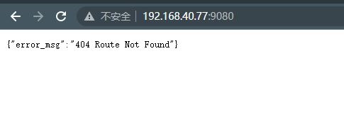
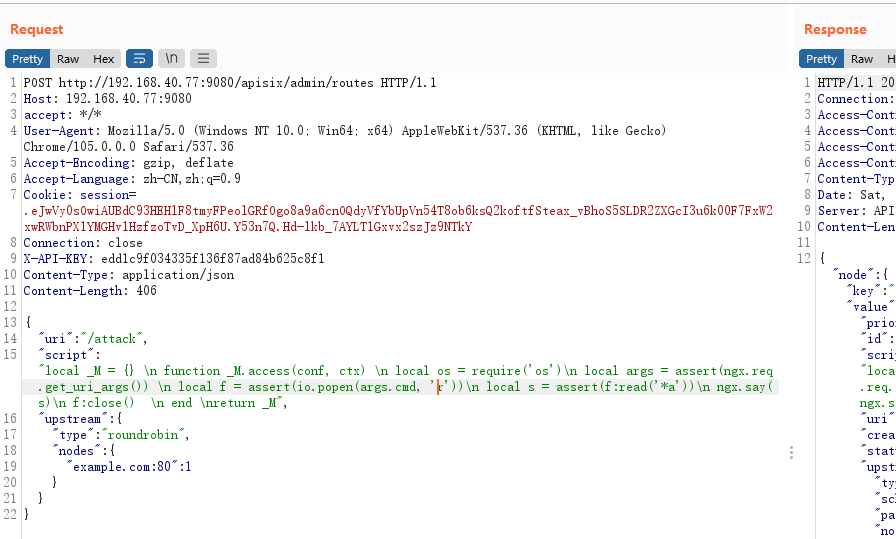
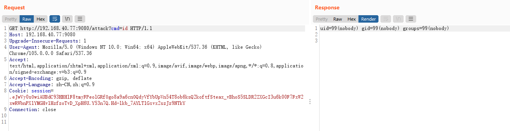

# Apache APISIX 默认密钥漏洞

> 漏洞说明

Apache APISIX是一个高性能API网关。在用户未指定管理员Token或使用了默认配置文件的情况下，Apache APISIX将使用默认的管理员Token 'edd1c9f034335f136f87ad84b625c8f1'，攻击者利用这个Token可以访问到管理员接口，进而通过 'script' 参数来插入任意LUA脚本并执行。

> 前提条件

无

> 利用工具

> 漏洞复现

环境启动后，访问http://192.168.40.77:9080即可查看到默认的404页面。

burp suite抓包后利用默认Token增加一个恶意的router，其中包含恶意LUA脚本

访问http://192.168.40.77:9080/attack?cmd=id,成功命令执行

