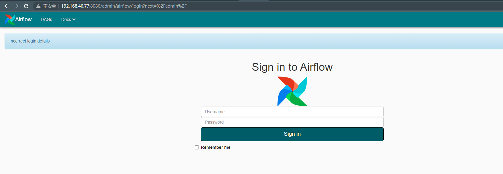
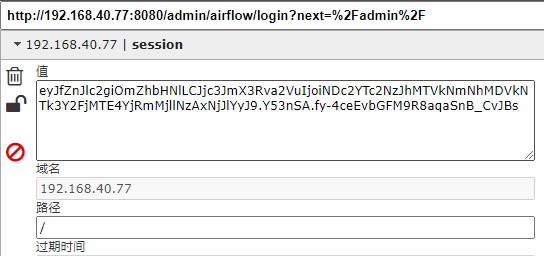
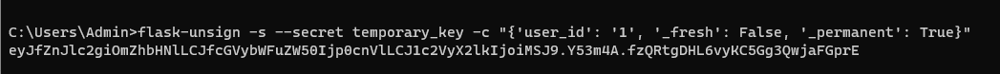
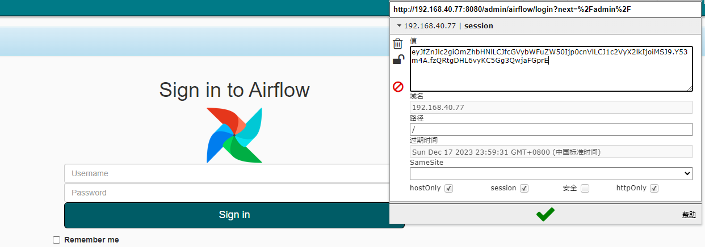
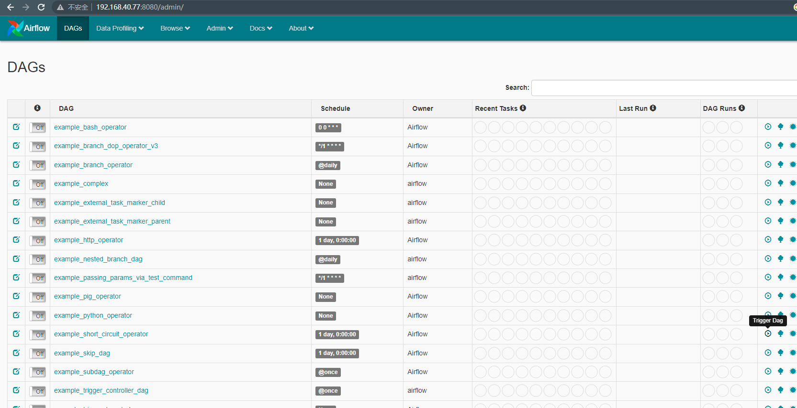

# Apache Airflow 默认密钥导致的权限绕过

> 漏洞说明

pache Airflow是一款开源的，分布式任务调度框架。默认情况下，Apache Airflow无需用户认证，但管理员也可以通过指定webserver.authenticate=True来开启认证。

在其1.10.13版本及以前，即使开启了认证，攻击者也可以通过一个默认密钥来绕过登录，伪造任意用户。

> 前提条件

版本：Apache Airflow <= 1.10.13

> 利用工具

[flask-unsign](https://github.com/Paradoxis/Flask-Unsign)

> 漏洞复现

访问登陆页http://192.168.40.77:8080/admin/airflow/login

可以看到服务器返回签名后的cookie

利用[flask-unsign](https://github.com/Paradoxis/Flask-Unsign)爆破签名时使用的SECRET_KEY

key为temporary_key,用其生成一个新的session，伪造user_id为1：

修改session，成功登录

