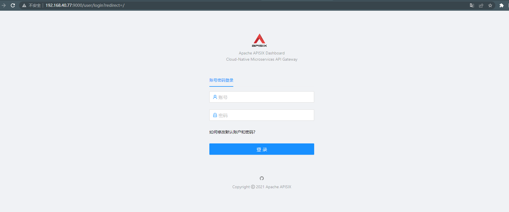
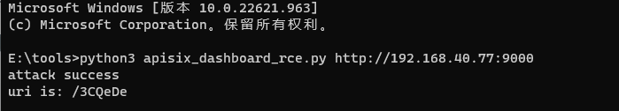
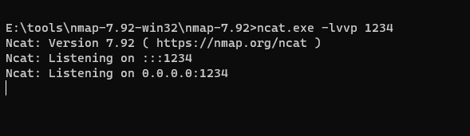
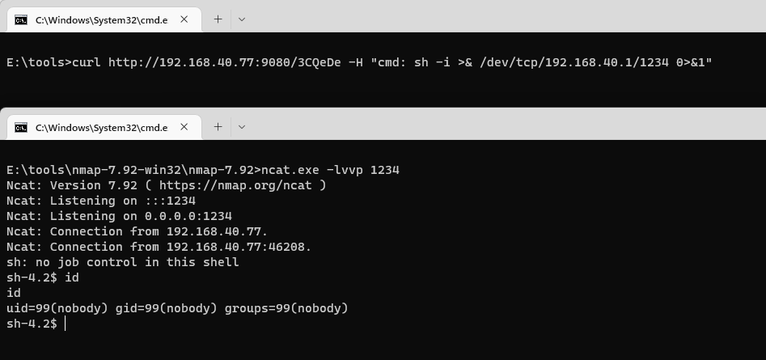

# Apache APISIX Dashboard API权限绕过导致RCE

> 漏洞说明

Apache APISIX是一个动态、实时、高性能API网关，而Apache APISIX Dashboard是一个配套的前端面板。

Apache APISIX Dashboard 2.10.1版本前存在两个API/apisix/admin/migrate/export和/apisix/admin/migrate/import，他们没有经过droplet框架的权限验证，导致未授权的攻击者可以导出、导入当前网关的所有配置项，包括路由、服务、脚本等。攻击者通过导入恶意路由，可以用来让Apache APISIX访问任意网站，甚至执行LUA脚本。

> 前提条件

版本：Apache APISIX Dashboard < 2.10.1

> 利用工具

[apisix_dashboard_rce.py](https://github.com/wuppp/cve-2021-45232-exp/blob/main/apisix_dashboard_rce.py)

> 漏洞复现

访问http://192.168.40.77:9000/可以看到Apache APISIX Dashboard登录页

执行exp获取CRC校验码

添加完恶意路由后，需要访问Apache APISIX中对应的路径来触发前面添加的脚本。Apache APISIX和Apache APISIX Dashboard是两个不同的服务，Apache APISIX Dashboard只是一个管理页面，而添加的路由是位于Apache APISIX中，所以需要找到Apache APISIX监听的端口或域名。

开启本地监听

对Apache APISIX监听的9080端口发送反弹shell指令，成功getshell

