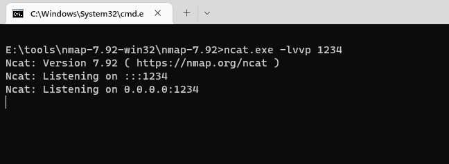
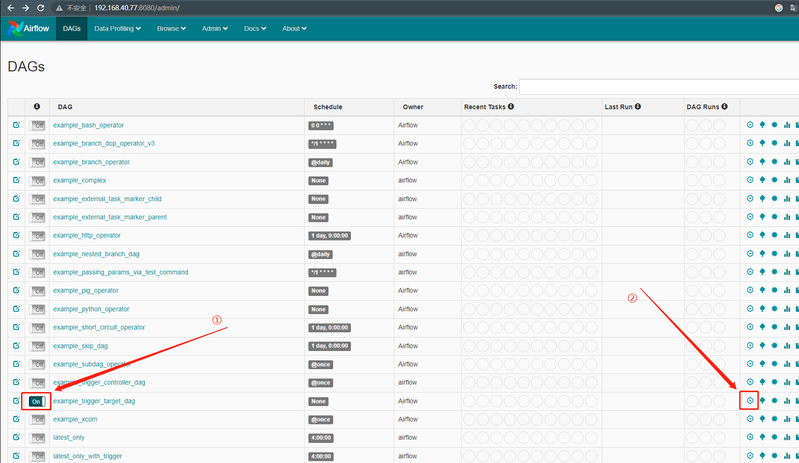
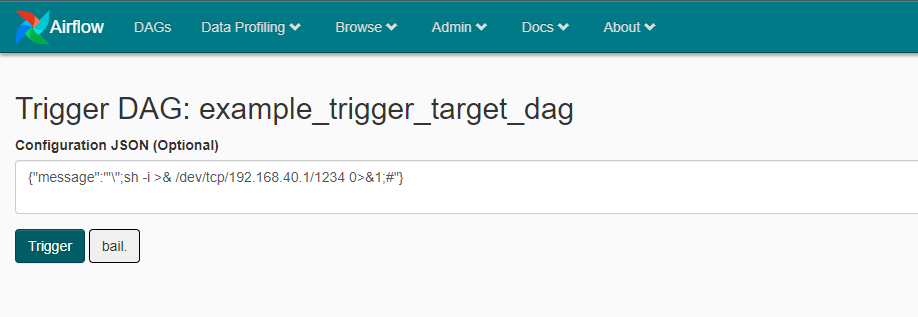
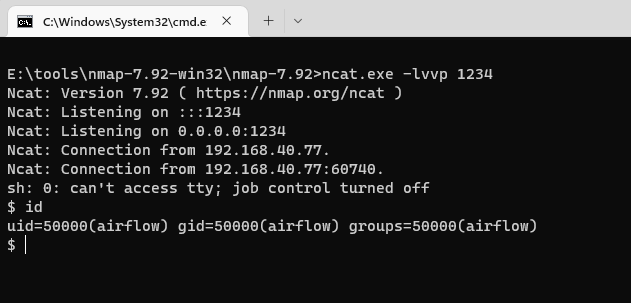

# Apache Airflow 示例dag中的命令注入

> 漏洞说明

Apache Airflow是一款开源的，分布式任务调度框架。在其1.10.10版本及以前的示例DAG中存在一处命令注入漏洞，未授权的访问者可以通过这个漏洞在Worker中执行任意命令。

> 前提条件

版本：Apache Airflow <= 1.10.10

> 利用工具

无

> 漏洞复现

开启本地监听

访问http://192.168.40.77:8080/admin/，在管理端开启example_trigger_target_dag配置并点击执行按钮

输入反弹shell攻击语句点击Trigger执行

等待显示执行成功

监听端口成功getshell

