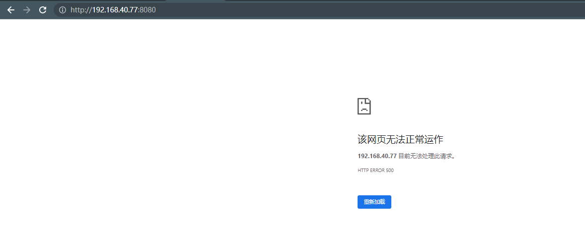
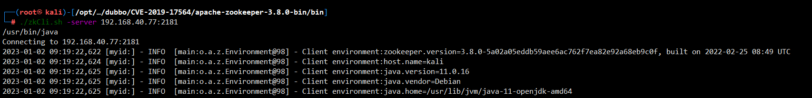
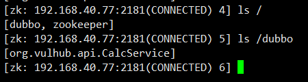
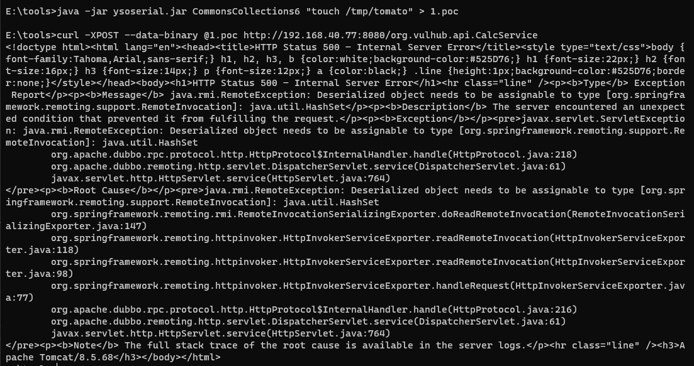
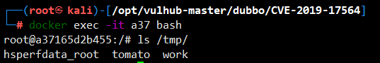

# Aapche Dubbo Java反序列化漏洞（CVE-2019-17564）

> 漏洞说明

Apache Dubbo是一款高性能、轻量级的开源Java RPC服务框架。Dubbo可以使用不同协议通信，当使用http协议时，Apache Dubbo直接使用了Spring框架的org.springframework.remoting.httpinvoker.HttpInvokerServiceExporter类做远程调用，而这个过程会读取POST请求的Body并进行反序列化，最终导致漏洞。

> 前提条件

> 利用工具

> 漏洞复现

启动环境访问http://192.168.40.77:8080/返回500

利用该漏洞需要先知道目标RPC接口名，而Dubbo所有的RPC配置储存在registry中，通常使用Zookeeper作为registry。如果能刚好找到目标的Zookeeper未授权访问漏洞，那么就可以在其中找到接口的名称与地址。

Vulhub对外开放了8080端口和2181端口，其中2181即为Zookeeper的端口，我们本地下载[Zookeeper](https://zookeeper.apache.org/)，使用其中自带的zkCli即可连接到这台Zookeeper服务器

连接后进入一个交互式控制台，使用ls即可列出其中所有节点，包括Dubbo相关的配置

获取到RPC接口名为org.vulhub.api.CalcService。直接用ysoserial生成CommonsCollections6的Payload作为POST Body发送到http://192.168.40.77:8080/org.vulhub.api.CalcService即可触发反序列化漏洞

进入容器，命令成功执行

