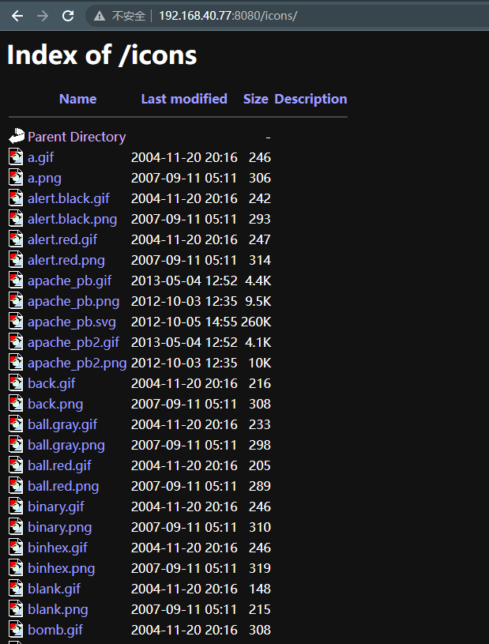
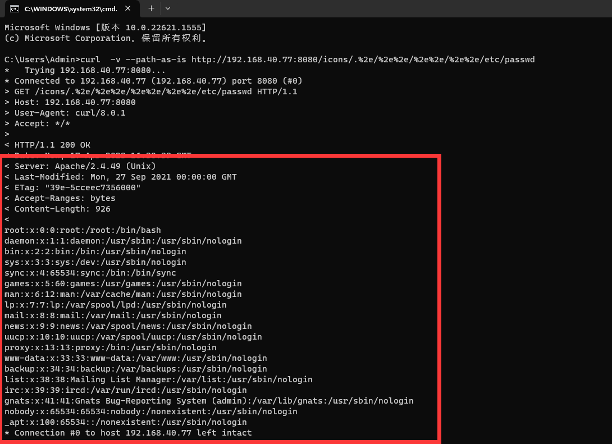

# Apache HTTP Server 2.4.49 路径遍历和文件泄露漏洞 (CVE-2021-41773)

> 漏洞说明

Apache HTTP 服务器项目旨在为包括 UNIX 和 Windows 在内的现代操作系统开发和维护开源 HTTP 服务器。

在 Apache HTTP Server 2.4.49 中对路径规范化所做的更改中发现了一个缺陷。攻击者可以使用路径遍历攻击将 URL 映射到预期文档根目录之外的文件。

如果这些目录之外的文件不受通常的默认配置“require all denied”的保护，这些请求可以成功。如果还为这些别名路径启用了 CGI 脚本，这可能允许远程代码执行。

> 前提条件

> 利用工具

> 漏洞复现

搭建靶场，访问http://192.168.40.77:8080

该漏洞需要已知一个现有目录，靶场中已知有icons目录

curl目录穿越读取/etc/passwd

