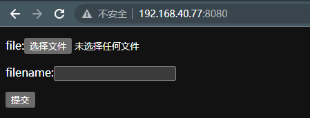
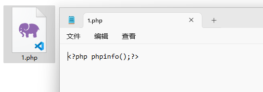
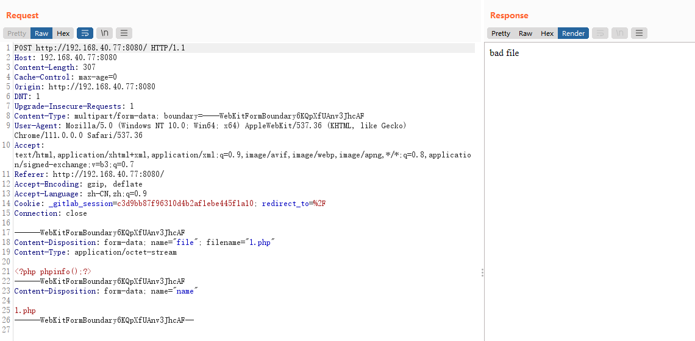
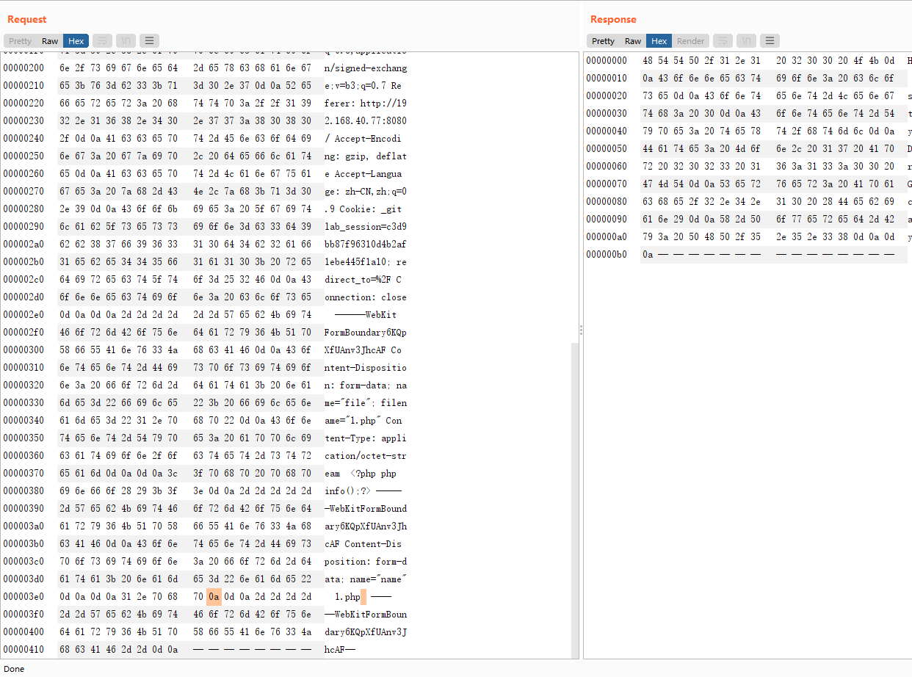
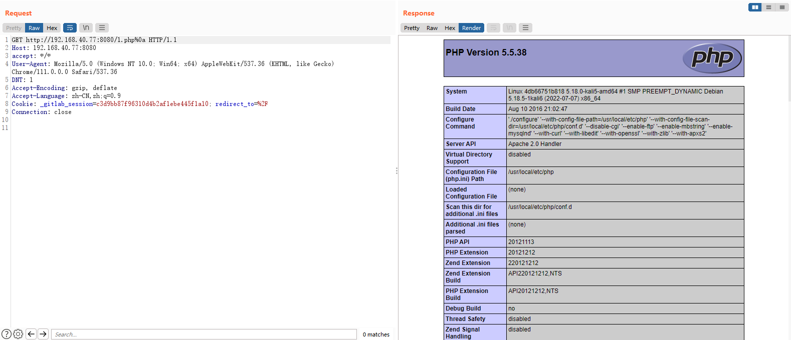

# Apache HTTPD 换行解析漏洞（CVE-2017-15715）

> 漏洞说明

Apache HTTPD是一款HTTP服务器，它可以通过mod_php来运行PHP网页。其2.4.0~2.4.29版本中存在一个解析漏洞，在解析PHP时，`1.php\x0A`将被按照PHP后缀进行解析，导致绕过一些服务器的安全策略。

> 前提条件

> 利用工具

> 漏洞复现

搭建靶场，访问http://192.168.40.77:8080/

开启bp,上传文件1.php

直接被拦截

插入\x0a,可以成功上传

访问http://192.168.40.77/1.php%0a可以看到文件被解析

经测试加空格(%20)也可以成功上传，但无法解析
