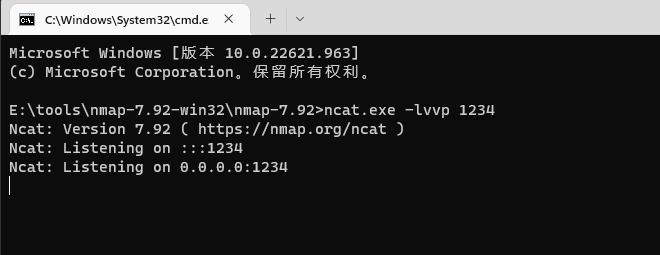
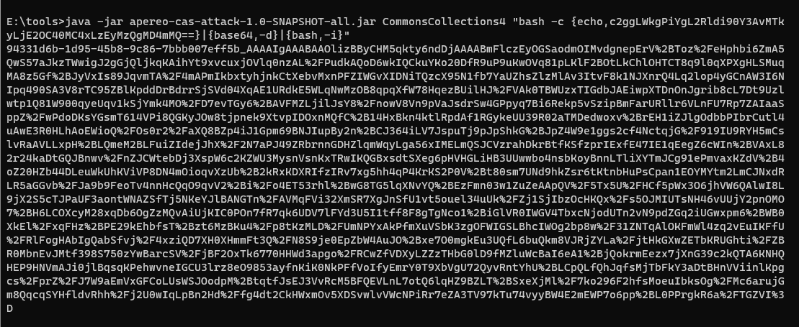
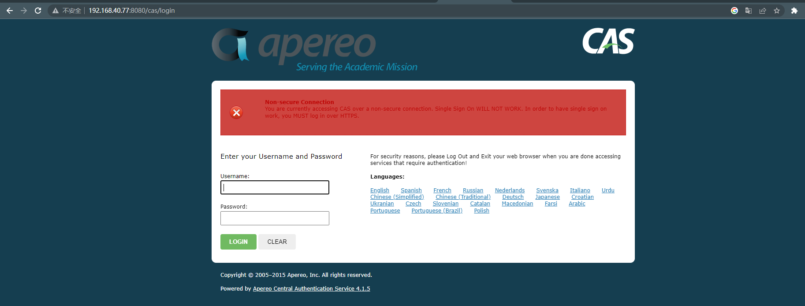
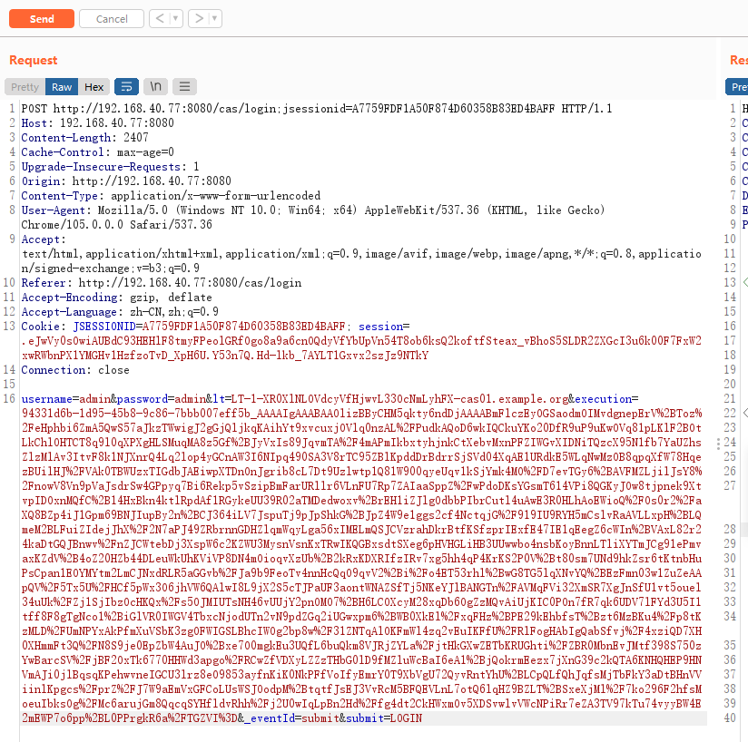
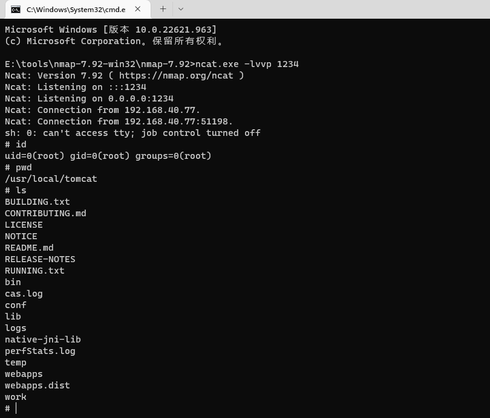

# Apereo CAS 4.1 反序列化命令执行漏洞

> 漏洞说明

Apereo CAS是一款Apereo发布的集中认证服务平台，常被用于企业内部单点登录系统。其4.1.7版本之前存在一处默认密钥“changeit”的问题，利用这个默认密钥我们可以构造恶意信息触发目标反序列化漏洞，进而执行任意命令。

> 前提条件

> 利用工具

[Apereo-CAS-Attack](https://github.com/vulhub/Apereo-CAS-Attack/releases/download/v1.0.0/apereo-cas-attack-1.0-SNAPSHOT-all.jar)

> 漏洞复现

开启本地监听

加密反弹shell的payload

访问CAS主页http://192.168.40.77:8080/cas/login

登录并抓包，将Body中的execution值替换成上面生成的Payload发送

成功getshell

