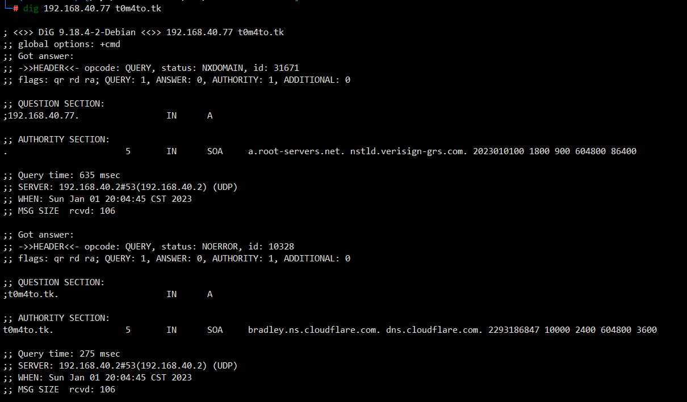
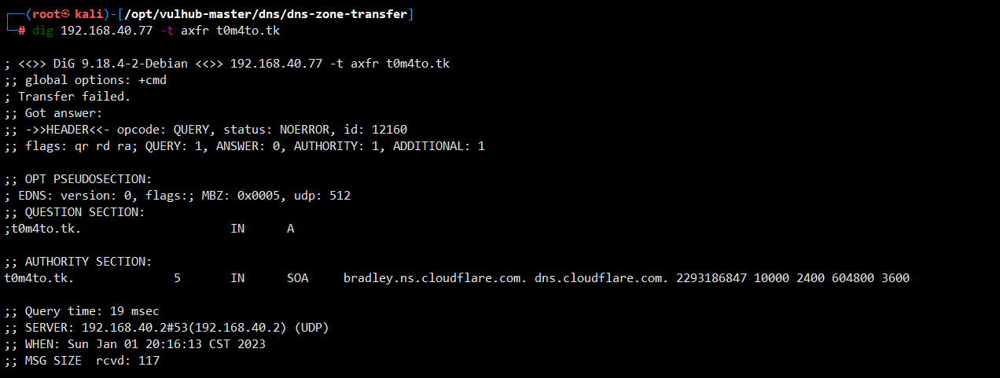

## CVE-2016-3088

> 漏洞说明

DNS协议支持使用axfr类型的记录进行区域传送，用来解决主从同步的问题。如果管理员在配置DNS服务器的时候没有限制允许获取记录的来源，将会导致DNS域传送漏洞。

> 前提条件

> 利用工具

> 漏洞复现

使用dig命令来发送dns请求。用dig 192.168.40.77 t0m4to.tk获取域名t0m4to.tk在目标dns服务器上的A记录

发送axfr类型的dns请求dig 192.168.40.77 -t axfr t0m4to.tk

获取到了t0m4to.tk的所有子域名记录，这里存在DNS域传送漏洞。

