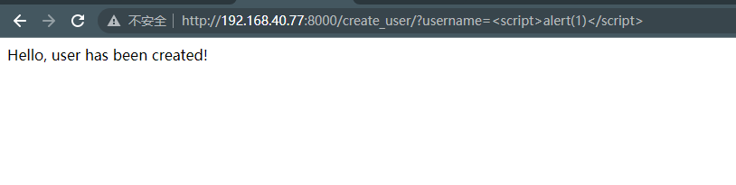
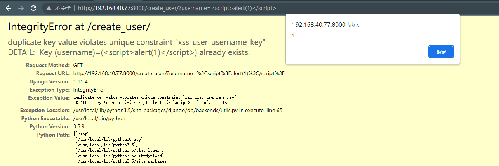

# Django debug page XSS漏洞（CVE-2017-12794）

> 漏洞说明

Django 1.11.5版本之前，在500页面存在的一个 XSS 漏洞

> 前提条件

版本：Django < 1.11.5 

> 利用工具

> 漏洞复现

启动漏洞环境，访问http://192.168.40.77:8000/create_user/?username=创建一个用户，成功；

再次访问http://192.168.40.77:8000/create_user/?username=，成功触发XSS

