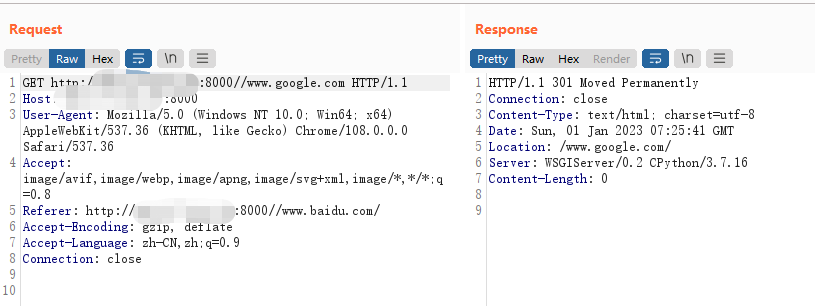

# Django < 2.0.8 任意URL跳转漏洞（CVE-2018-14574）

> 漏洞说明

Django默认配置下，如果匹配上的URL路由中最后一位是/，而用户访问的时候没加/，Django默认会跳转到带/的请求中。（由配置项中的django.middleware.common.CommonMiddleware、APPEND_SLASH来决定）。

在path开头为//example.com的情况下，Django没做处理，导致浏览器认为目的地址是绝对路径，最终造成任意URL跳转漏洞。

该漏洞利用条件是目标URLCONF中存在能匹配上//example.com的规则。

> 前提条件

版本：Django < 2.0.8 

> 利用工具

> 漏洞复现

启动靶场，访问8000端口

url添加//www.google.com即可成功301跳转到所添加地址

