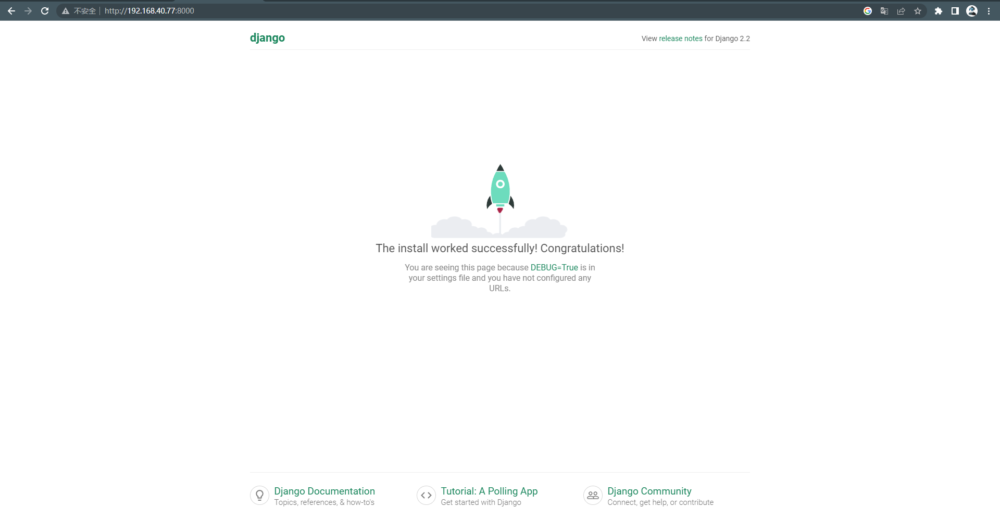
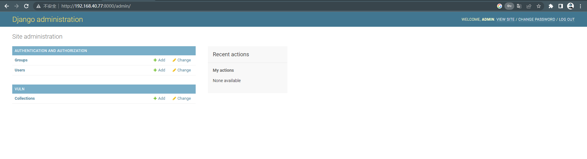
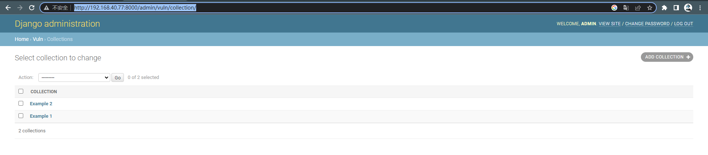
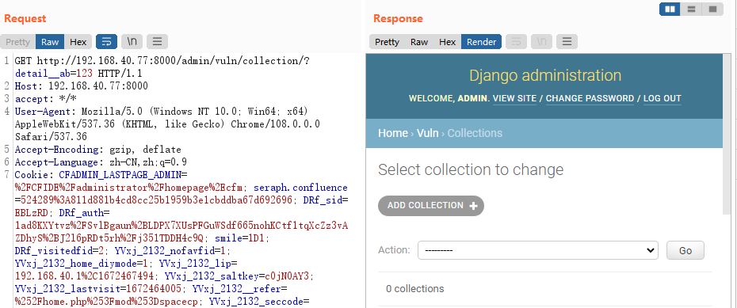
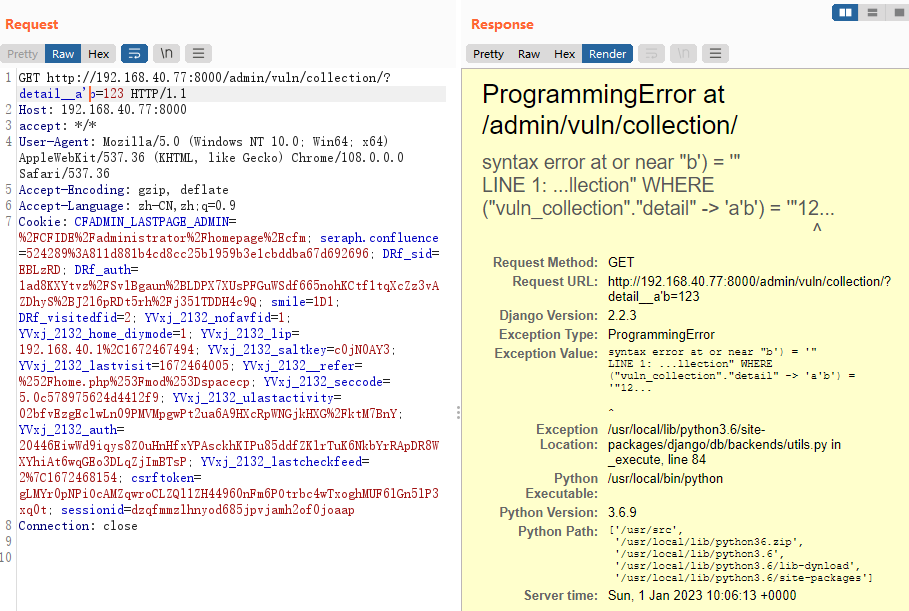

# Django JSONField/HStoreField SQL注入漏洞（CVE-2019-14234）

> 漏洞说明

Django在2019年8月1日发布了一个安全更新，修复了在JSONField、HStoreField两个模型字段中存在的SQL注入漏洞。

该漏洞需要开发者使用了JSONField/HStoreField，且用户可控queryset查询时的键名，在键名的位置注入SQL语句。Django自带的后台应用Django-Admin中就存在这样的写法，我们可以直接借助它来复现漏洞。

> 前提条件

> 利用工具

> 漏洞复现

启动环境，访问http://192.168.40.77:8000/即可看到jdango默认页面

访问后台页面http://192.168.40.77:8000/admin登录admin/a123123123

进入collections管理页面http://192.168.40.77:8000/admin/vuln/collection/

访问http://192.168.40.77:8000/admin/vuln/collection/?detail__ab=123如下

在ab之间添加单引号，可知此处有注入

