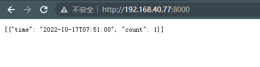
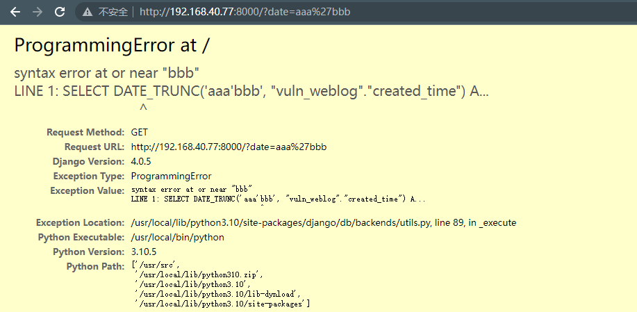

# Django Trunc(kind) and Extract(lookup_name) SQL注入漏洞（CVE-2022-34265）

> 漏洞说明

Django在2022年7月4日发布了安全更新，修复了在数据库函数Trunc()和Extract()中存在的SQL注入漏洞。

> 前提条件

> 利用工具

> 漏洞复现

环境启动后，在http://192.168.40.77:8000看到一个页面。

这个页面使用了Trunc函数来聚合页面点击数量，使用http://192.168.40.77:8000/?date=minute即可看到按照分钟聚合的点击量,修改data即可发现注入点

