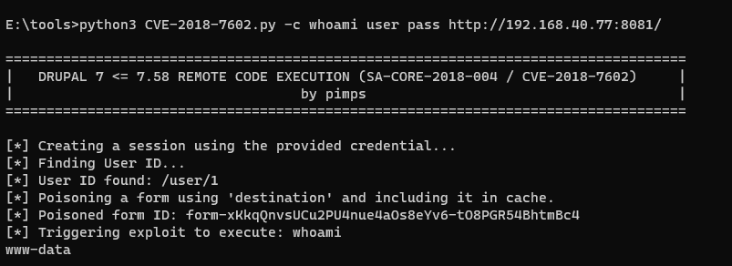

# Drupal 远程代码执行漏洞（CVE-2018-7602）

> 漏洞说明

Drupal是Drupal社区的一套使用PHP语言开发的开源内容管理系统。 此漏洞源于对编号为CVE-2018-7600的漏洞修复不完全，导致补丁被绕过，攻击者可以利用Drupal网站漏洞，需要登录且有删除权限后触发执行恶意代码，导致网站被完全控制。


> 前提条件

Drupal < 7.58
Drupal < 8.3.9
Drupal < 8.4.6
Drupal < 8.5.1


> 利用工具

[POC](https://github.com/pimps/CVE-2018-7600/blob/master/drupa7-CVE-2018-7602.py)


> 漏洞复现

启动环境，直接利用POC验证漏洞

```shell
python3 CVE-2018-7602.py -c whoami user pass http://192.168.40.77:8081/
```

