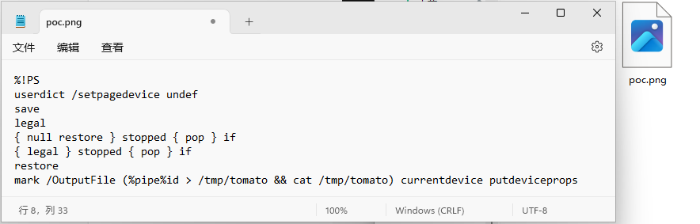

# GhostScript 沙箱绕过（命令执行）漏洞（CVE-2018-16509）

> 漏洞说明

​	2018年8月21日，Tavis Ormandy 的公开邮件列表指出，GhostScript 的安全沙箱可以被绕过，通过构造恶意的图片内容，将可以造成命令执行、文件读取、文件删除等漏洞

- http://seclists.org/oss-sec/2018/q3/142
- https://bugs.chromium.org/p/project-zero/issues/detail?id=1640

> 前提条件

​	Ghostscript <=9.24

> 利用工具

​	[poc.png](../img/GhostScript_CVE-2018-16509/poc.png)

> 漏洞复现

​	启动靶场，访问http://192.168.40.77:8080/可以看到一个文件上传页面

​	上传文件poc.png

​	成功传文件并执行命令

