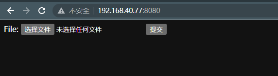
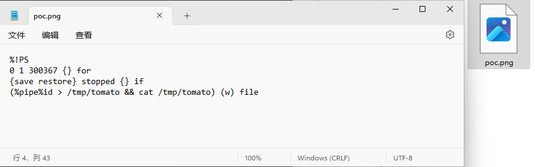
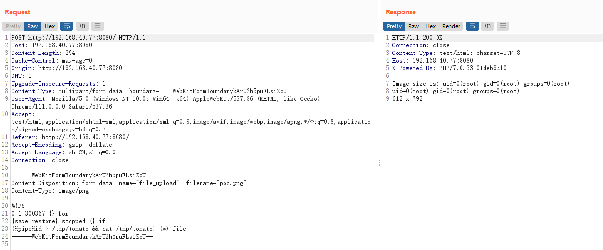

# GhostScript 沙箱绕过（命令执行）漏洞（CVE-2018-19475）

> 漏洞说明

​	2018年底来自Semmle Security Research Team的Man Yue Mo发表了CVE-2018-16509漏洞的变体CVE-2018-19475，可以通过一个恶意图片绕过GhostScript的沙盒，进而在9.26以前版本的gs中执行任意命令。

> 前提条件

​	GhostScript <= 9.26

> 利用工具

​	[poc.png](../img/poc.png)

> 漏洞复现

启动靶场，访问http://192.168.40.77:8080/可以看到一个文件上传页面

上传文件

成功命令执行

