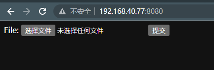
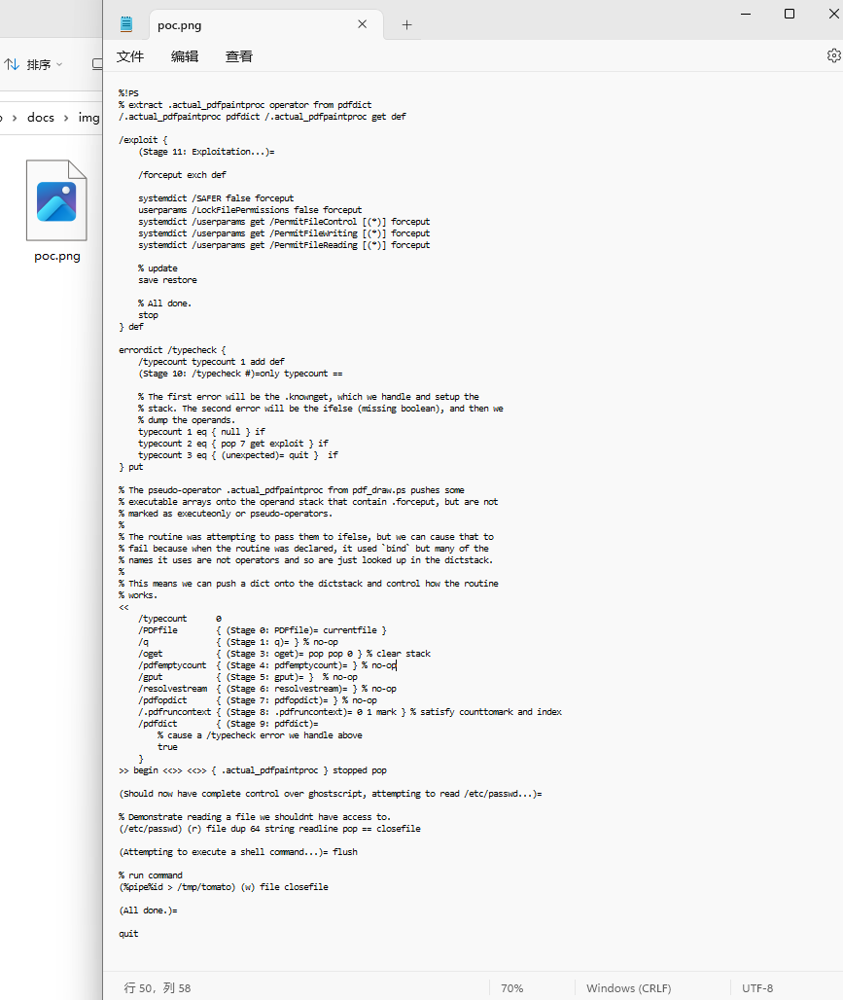
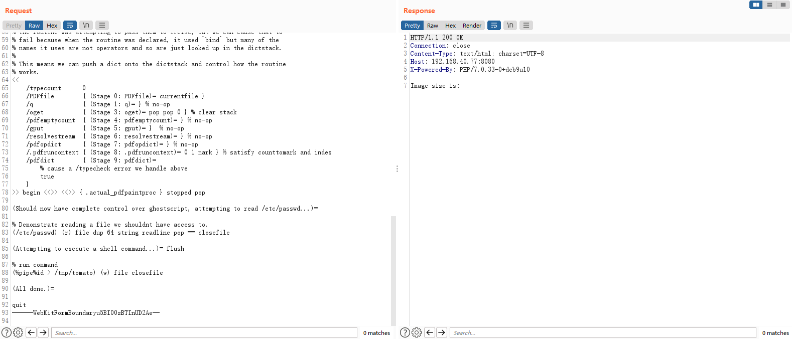
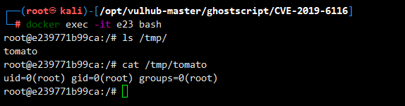

# GhostScript 沙箱绕过（命令执行）漏洞（CVE-2019-6116）

> 漏洞说明

​	2019年1月23日晚，Artifex官方在ghostscriptf的master分支上提交合并了多达6处的修复。旨在修复 CVE-2019-6116 漏洞，该漏洞由 Google 安全研究员 Tavis 于2018年12月3日提交。该漏洞可以直接绕过 ghostscript 的安全沙箱，导致攻击者可以执行任意命令/读取任意文件。

> 前提条件

> 利用工具

[poc.png](../img/poc.png)

> 漏洞复现

启动靶场，访问http://192.168.40.77:8080/可以看到一个文件上传页面

上传poc.png

靶机可以看到成功上传文件并命令执行

