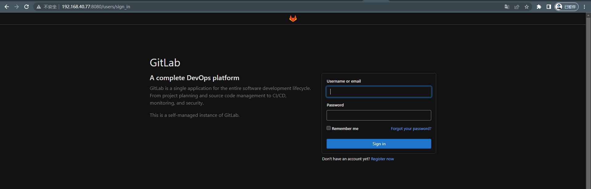
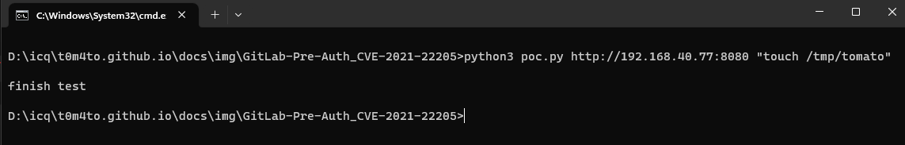
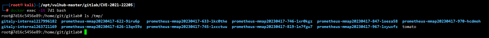

# GitLab Pre-Auth 远程命令执行 (CVE-2021-22205)

> 漏洞说明

​	GitLab 是一个基于 Web 的 DevOps 生命周期工具，它提供了一个 Git 存储库管理器，提供 wiki、问题跟踪以及持续集成和部署管道功能。

​	在影响从 11.9 开始的版本的 GitLab CE/EE 中发现了一个问题。GitLab 没有正确验证传递给文件解析器的图像文件，导致未经身份验证的远程命令执行。

> 前提条件

> 利用工具

[poc.py](https://github.com/vulhub/vulhub/blob/master/gitlab/CVE-2021-22205/poc.py)

> 漏洞复现

搭建靶场，访问http://192.168.40.77:8080/

通过未授权接口/uploads/user进行攻击

在靶机可以验证命令成功执行

