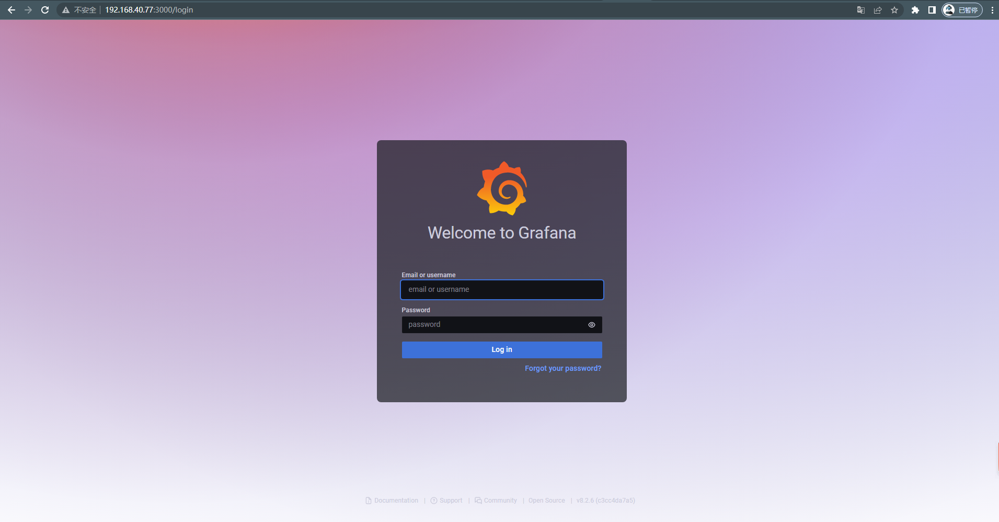
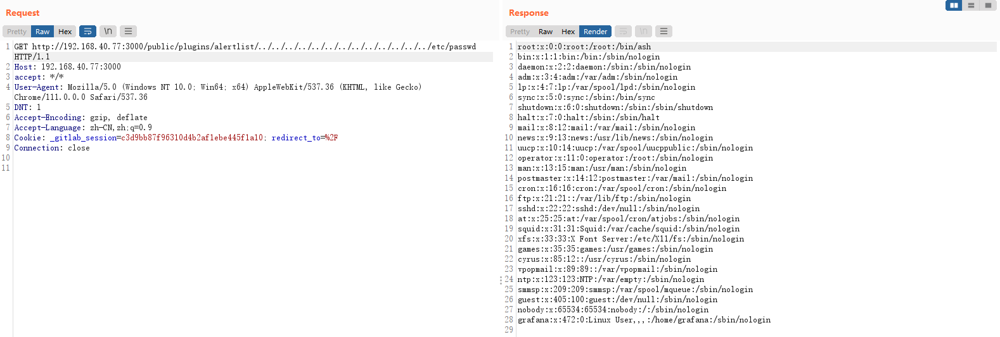

# Grafana 8.x 插件模块目录穿越漏洞（CVE-2021-43798）

> 漏洞说明

​	Grafana是一个开源的度量分析与可视化套件。在2021年12月，推特用户@j0v 发表了他发现的一个0day，攻击者利用这个漏洞可以读取服务器上的任意文件。

> 前提条件


> 利用工具


> 漏洞复现

搭建靶场，访问http://192.168.40.77:3000/可以看到登录页



这个漏洞出现在插件模块中，这个模块支持用户访问插件目录下的文件，但因为没有对文件名进行限制，攻击者可以利用`../`的方式穿越目录，读取到服务器上的任意文件。

我们需要先获取到一个已安装的插件id，常见的id有：

```tex
alertlist
cloudwatch
dashlist
elasticsearch
graph
graphite
heatmap
influxdb
mysql
opentsdb
pluginlist
postgres
prometheus
stackdriver
table
text
```

测试出id后直接构造数据包读取/etc/passwd


