# JANGO：1.0.1

## 环境搭建

### 镜像下载

靶机 OVA 下载地址：https://download.vulnhub.com/jangow/jangow-01-1.0.1.ova


### 系统问题排查

系统启动后报错信息显示网络接口启动失败


在 grub 菜单按 e 编辑启动项

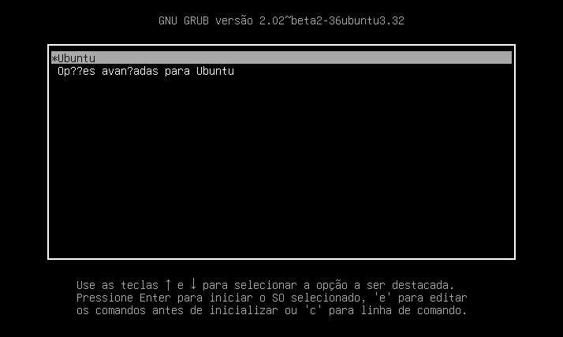


将 ro 替换为 rw signie init=/bin/bash

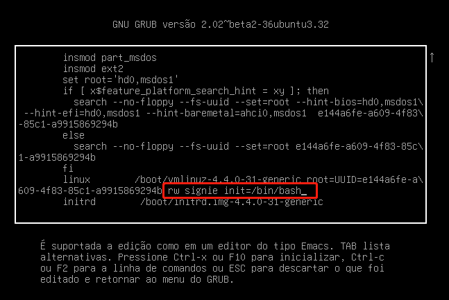


按 Ctrl+x 进入单用户模式

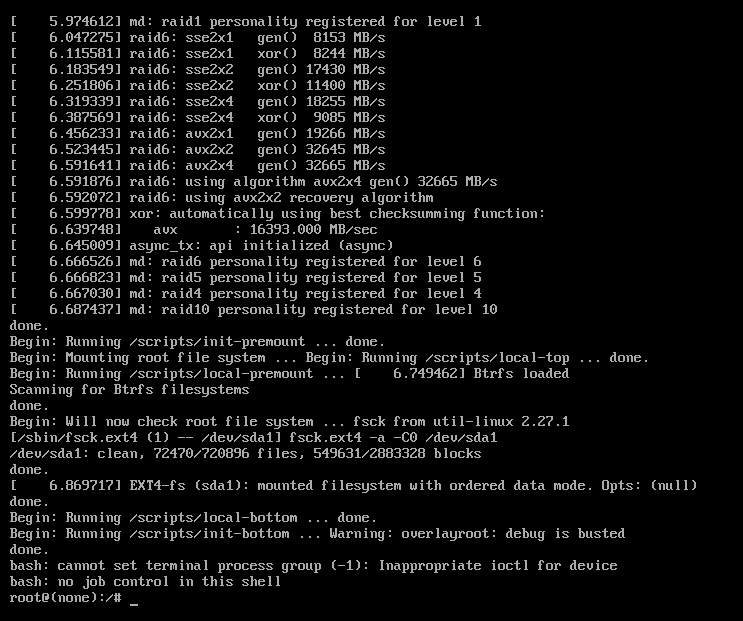


### 键盘布局

系统键盘布局如下


这里我数字键盘中的 / 可以正常使用访问目录，? 输出为 : 用于修改和保存配置文件;若想修改键盘布局，可以输入 dpkg-reconfigure keyboard-configuration 选择通用 105 键

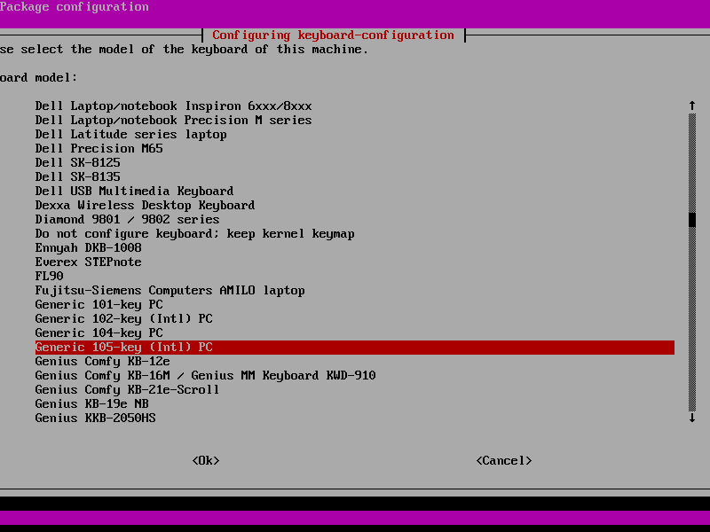


按以下选项选择键盘布局

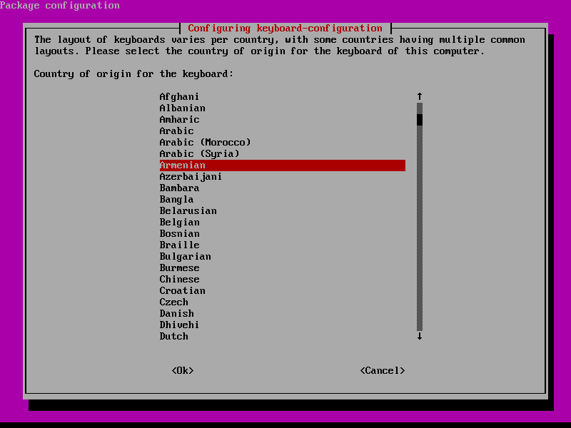


其他默认按回车即可，此时键盘布局为美式键盘

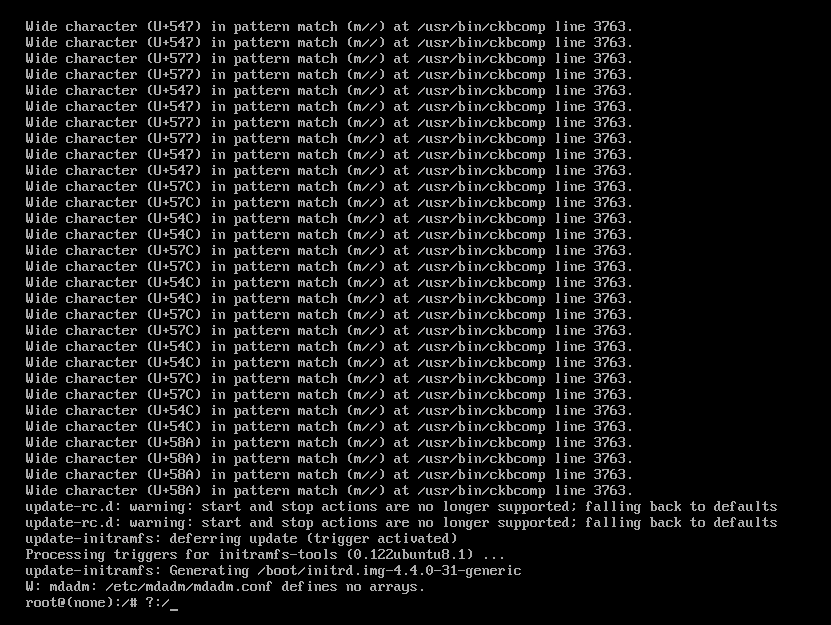


### 网络故障处理

查看网卡信息和配置文件，可以看到网卡名称不匹配，故而导致无法正常获取 ip

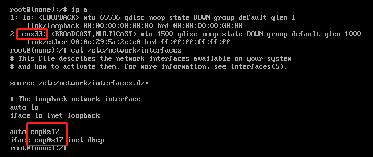


修改网卡名称

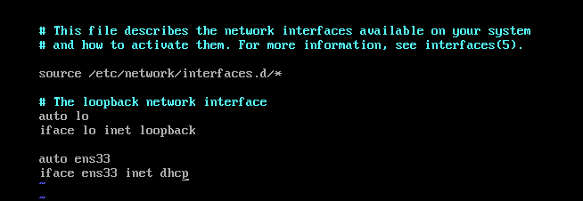


重启网卡服务 /etc/init.d/networking restart

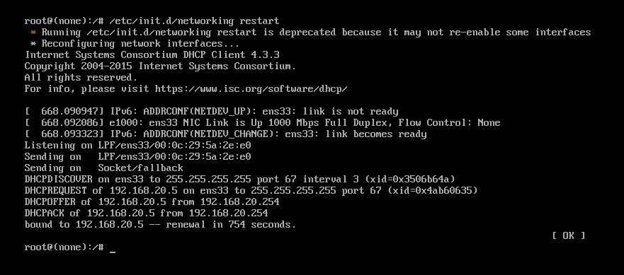


成功获取到 ip

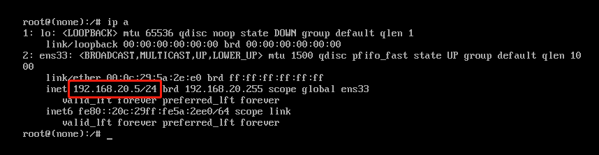


重启虚拟机，环境准备完成


### 环境准备

攻击机kali

- 192.168.20.4

靶机jangow01

- 192.168.20.5


## 靶机渗透

### 主机发现

```shell
┌──(root㉿kali)-[~]
└─# nmap -sn 192.168.20.0/24
Starting Nmap 7.92 ( https://nmap.org ) at 2022-09-14 22:11 CST
Nmap scan report for 192.168.20.5
Host is up (0.00066s latency).
MAC Address: 00:0C:29:5A:2E:E0 (VMware)
Nmap scan report for 192.168.20.254
Host is up (0.00016s latency).
MAC Address: 00:50:56:F5:70:18 (VMware)
Nmap scan report for 192.168.20.4
Host is up.
Nmap done: 256 IP addresses (3 hosts up) scanned in 27.95 seconds

```


### 端口扫描

```shell
┌──(root㉿kali)-[~]
└─# nmap -sV -p- 192.168.20.5   
Starting Nmap 7.92 ( https://nmap.org ) at 2022-09-14 22:22 CST
Nmap scan report for 192.168.20.5
Host is up (0.00062s latency).
Not shown: 65533 filtered tcp ports (no-response)
PORT   STATE SERVICE VERSION
21/tcp open  ftp     vsftpd 3.0.3
80/tcp open  http    Apache httpd 2.4.18
MAC Address: 00:0C:29:5A:2E:E0 (VMware)
Service Info: Host: 127.0.0.1; OS: Unix

Service detection performed. Please report any incorrect results at https://nmap.org/submit/ .
Nmap done: 1 IP address (1 host up) scanned in 124.93 seconds

```


### 服务探测

访问 http 服务，发现一个 site 目录

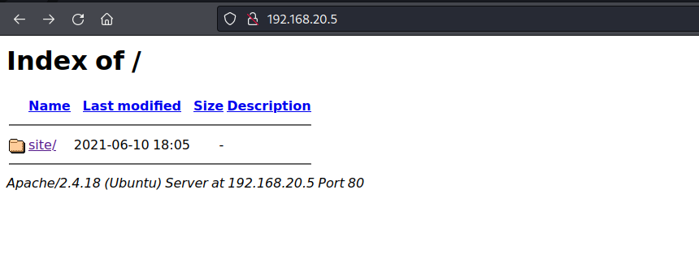

### 站点发现

该目录下存在如下网站


### 站点测试

对站点各处按钮点击测试，发现点击 Buscar 跳转到一个接口空页

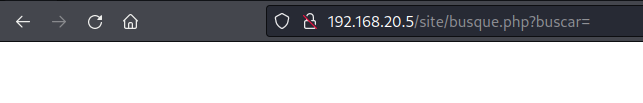


拼接 id 回显如下，可以判断该服务器为 Linux 系统，此处有命令执行

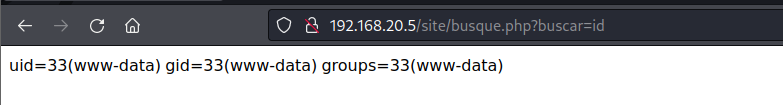


并且可以获取到服务器系统版本信息


### GET SHELL


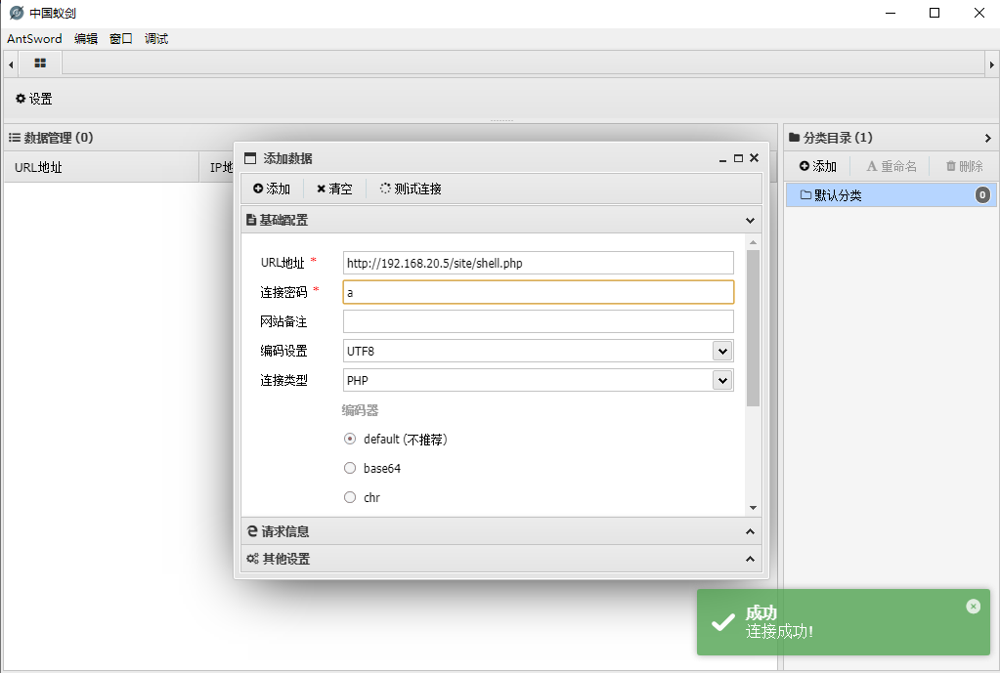
